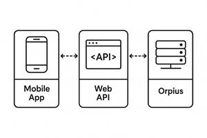
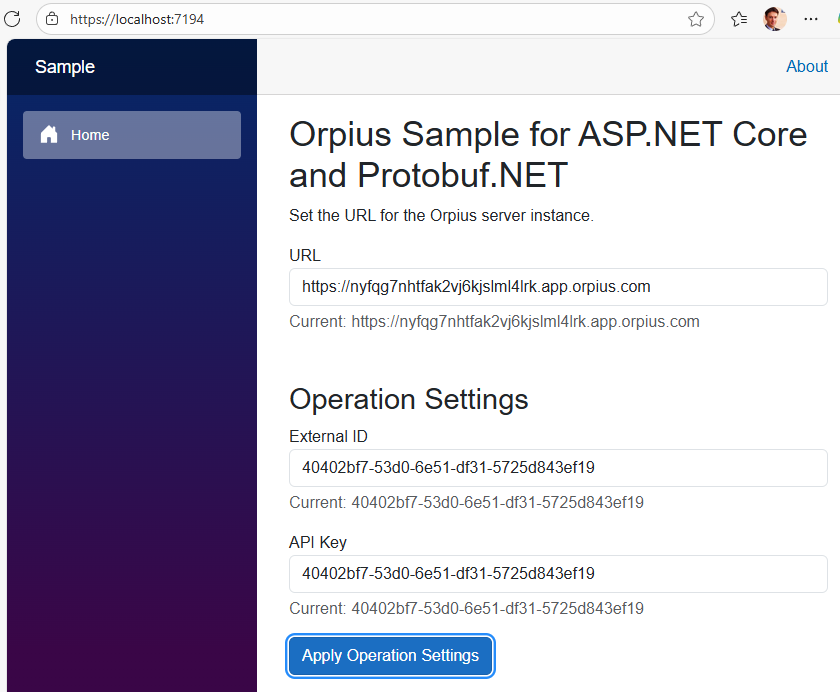
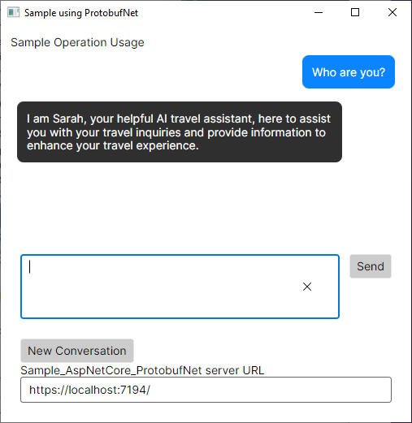
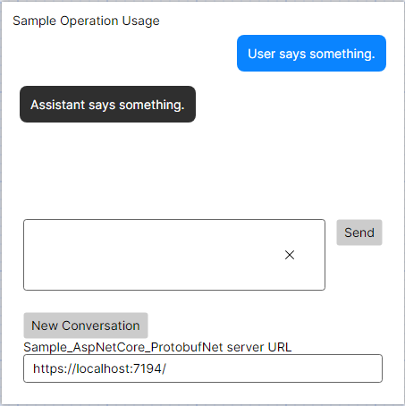
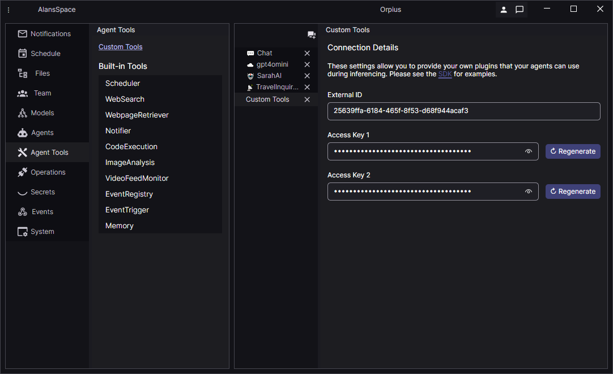
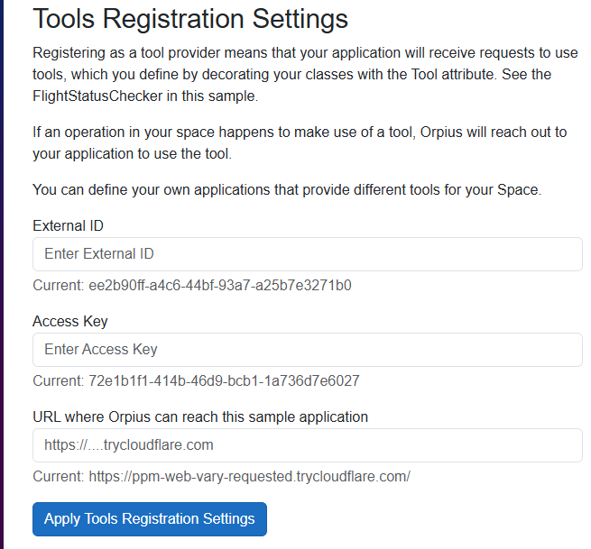
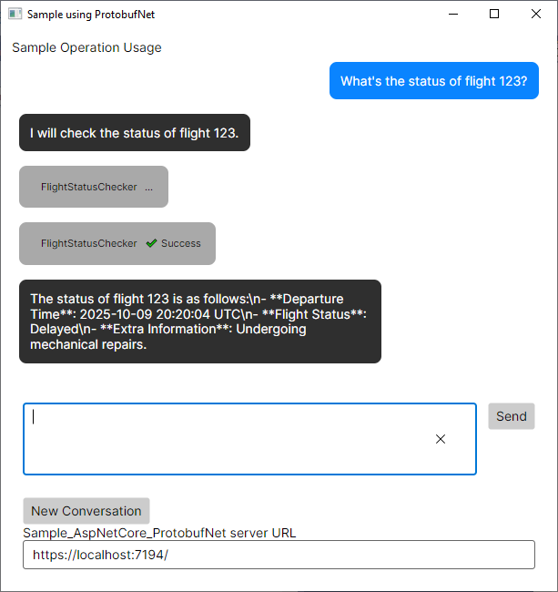

# Orpius SDK Developer Guide for .NET

<!--TOC-->
  - [Getting Started with the Orpius SDK](#getting-started-with-the-orpius-sdk)
  - [Setting up Your Middle-Tier Application](#setting-up-your-middle-tier-application)
  - [Calling Your Operation](#calling-your-operation)
  - [Including Call Specific Information in a Chat](#including-call-specific-information-in-a-chat)
  - [Exploring the Mobile App Sample](#exploring-the-mobile-app-sample)
  - [Connecting Your Code to Orpius](#connecting-your-code-to-orpius)
    - [Understanding Custom Tools](#understanding-custom-tools)
    - [Initializing the Tooling Subsystem](#initializing-the-tooling-subsystem)
    - [Sharing Data between Tools and Operations](#sharing-data-between-tools-and-operations)
<!--/TOC-->

## Getting Started with the Orpius SDK

1. **Clone this repository**  
	```powershell
	git clone https://github.com/Orpius/SDK.git
	````

2. **Open the solution** in **Visual Studio 2022** (or later).

3. **Build and run** the sample application to confirm everything is working locally.
   By default, the sample project runs on:

	```
	https://localhost:7194
	```

---

If you haven't already, please read the [Operations section](../../UserGuide/Operations/)
of the user guide.

The [Orpius SDK repository](https://github.com/Orpius/SDK) contains various sample projects.
This section focuses on the *Sample_AspNetCore_ProtobufNet* project 
and the *Sample_MobileApp_ProtobufNet* project.
The ASP.NET Core sample shows how to set up your own web application so that 
it can communicate with the Orpius server.
The *MobileApp* project demonstrates how you might create a mobile or desktop
app that communicates directly with your web API application, which relays
communication from Orpius. See below.



*Communication from Mobile App to Web API to Orpius*

The Orpius SDK for .NET consists of a class library, 
*Orpius.Platform.ClientSdk.ProtobufNet*, which contains the types 
for creating and handling requests to and from the Orpius server;
and an Analyzer project, *Orpius.Platform.ClientSdk.ProtobufNet.Generators* 
that makes it easy to automatically generate 
nearly everything you need to provide your own custom APIs (tools) 
for your AI agents to use.

The aforementioned libraries are both available as the following NuGet packages:

* [Orpius.Platform.ClientSdk.ProtobufNet](https://www.nuget.org/packages/Orpius.Platform.ClientSdk.ProtobufNet)
* [Orpius.Platform.ClientSdk.ProtobufNet.Generators](https://www.nuget.org/packages/Orpius.Platform.ClientSdk.ProtobufNet.Generators)

> **Note:** Both libraries are currently available as pre-release packages, 
but will transition to release in the near future.

In this section, we look at enabling Operations. Operations allow your
middle-tier application (such as web application) to communicate with an Orpius server;
they allow you incorporate your custom AI agents into your own applications.

If you haven't done so already, create a new Operation in the Orpius client app.
See [Operations](../../UserGuide/Operations/Operations.md).

You'll need the *External ID* and *Access Key 1* to connect your application to Orpius.

Debugging the sample launches the sample mobile application and the sample
ASP.NET Core web application. The web application's home pages have fields
for your Operation settings. See below.



*Entering Operation Registration Information*

Once you've pasted your Orpius URL, entered your Operations credentials,
and pressed the *Apply Operation Settings* button, 
the sample mobile should relay input to your AI agent, as shown below:



*Chatting with the agent*

## Setting up Your Middle-Tier Application

In the SDK sample, the *Sample_AspNetCore_ProtobufNet* is a concise example
of the key parts that you are likely to have in your project.

It references the *Orpius.Platform.ClientSdk.ProtobufNet*, and *Orpius.Platform.ClientSdk.ProtobufNet.Generators* project.
You, however, will likely want to reference the NuGet packages mentioned above instead.

The `Program` class is the entry point for the application.

The first thing you may notice, is at the top of the file we have:

```cs
[assembly: GenerateToolRegistryItem("Sample_AspNetCore_ProtobufNet.ToolRegistration.SampleTools")]
```

This assembly level attribute `Orpius.Platform.Tooling.GenerateToolRegistryItemAttribute` instructs
the incremental code generator, located in the *Orpius.Platform.ClientSdk.ProtobufNet.Generators*
project, to generate the code representing the API surface of your custom tools. 
We explore custom tools, later in the document.

Communication with Orpius is done using the Google's [Protocol Buffers](https://protobuf.dev/) a.k.a., protobuf;
and Google's *gRPC* (remote procedure call) framework.
[Protobuf-net](https://github.com/protobuf-net/protobuf-net) is also used for code-first support.
In the following excerp, we use the extension methods afforded 
by these libraries to bring-in protobuf support.

```cs
services.AddGrpc();
services.AddCodeFirstGrpc();
services.AddSingleton(BinderConfiguration.Create(
	binder: new BinderFromServices(builder.Services)));
```

Following the protobuf initialization, we see a section related to custom tools.
We'll skip over that for now, and return to it later in this document.

Further down in the `Main` method of the `Program` class we see 
the section beginning with 'Orpius Operations'.
It is here that we provide the 'ExternalId' and the 'ApiKey' values from the operation:

```cs
FuncOperationsParameters funcOperationsParameters = new(
	() => ApplicationState.OperationsSettings.ExternalId,
	() => ApplicationState.OperationsSettings.ApiKey);
```

The `FuncOperationsParameters` class implements the `Orpius.Platform.OperationsModel.IOperationsServiceParameters` interface,
and provides a convenient way to pass the operation details to the Orpius subsystem.

We add the `funcOperationsParameters` object to the ASP.NET Core's *services* `IServiceCollection`:

```cs
services.AddSingleton<IOperationsServiceParameters>(funcOperationsParameters);
```

> **Note:** If you'd like to use more than one Operation in your application, 
you can by calling `services.AddSingleton<IOperationsServiceParameters>(anotherObject);`.

The `Program` class contains a method that retrieves the URL of the Orpius server; see below.

```cs
static Uri GetOrpiusServerUri() => new(ApplicationState.OrpiusServerUrl);
```

URLs of this type usually begin with a unique identifier (GUID) assigned to your organisation or environment.

**Format:**  
`https://{guid}.app.orpius.com`

**Example:**  
`https://fscnry5cyy3myzh55kky4jmgjx.app.orpius.com`

Finally, to complete our Operation's setup, we use the `AddOrpiusOperations`
extension method; passing it the GetOrpiusServerUri delegate 
that returns the Orpius server's base URL.

```cs
services.AddOrpiusOperations(GetOrpiusServerUri);
```

## Calling Your Operation

In the *Sample_AspNetCore_ProtobufNet* project 
there is a `IMyMobileAppService` gRPC service, with a single method `Chat`.

We'll use this service to accept incoming chat requests from our sample mobile
app in the project *Sample_MobileApp_ProtobufNet*.

There is nothing specific to Orpius in the service definition.
It merely defines a gRPC service with a single service method.

```cs
[Service("MyMobileAppService")]
public interface IMyMobileAppService
{
	IAsyncEnumerable<ChatResponse> Chat(MobileAppChatRequest request,
										CallContext context = default);
}
```

The single parameter of type `MobileAppChatRequest`, is shown below.
It uses the *Protobuf-net* `ProtoContractAttribute` and `ProtoMemberAttribute` attributes.
See below:

```cs
[ProtoContract]
public class MobileAppChatRequest
{
	[ProtoMember(1, IsRequired = true)]
	public required UserMessage UserMessage { get; set; }

	[ProtoMember(2, IsRequired = false)]
	public required Guid? ConversationId { get; set; }
}
```

The SDK's `UserMessage` type contains a `string` *Text* property,
which is the text that ultimately makes its way to your AI agent,
and a `Guid` *PublicId* property, which allows you to correlate messages in your application.
Response messages `AssistantMessage` and `SystemMessage` also contain a `PublicId` property.
We look closer at the request/response API later in the document.
**TODO: ensure we have this**

The `IMyMobileAppService` implementation is `MyMobileAppService` 
and it is located in the same directory.
This service is used by the *Sample_MobileApp_ProtobufNet* project.
Providing access to Orpius via a middle-ware application
allows us to keep the Orpius Operation's access key safely within
our middle-ware application, while also affording us the opportunity to enrich
calls to Orpius with user specific information.

The `IMyMobileAppService` is placed in the services collection in the `Program` class's `Main` method, like so:
```cs
services.AddAssociatedSingletons<IMyMobileAppService, MyMobileAppService>();
```

The `AddAssociatedSingletons` extension method is contained with the sample project.
We use it to register the interface for use with gRPC rather than the class itself.

```cs
static class ServiceCollectionExtensions
{
	internal static void AddAssociatedSingletons<TInterface, TImplementation>(
		this IServiceCollection services)
		where TInterface : class
		where TImplementation : class, TInterface
	{
		services.AddSingleton<TImplementation>();
		services.AddSingleton<TInterface>(
			sp => sp.GetRequiredService<TImplementation>());
	}
}
```

This allows us to then register the gRPC service, using its interface, like so:

```cs
app.MapGrpcService<IMyMobileAppService>();
```

Now you've seen how to register the custom service, let's take a look at its implementation.

The constructor for `MyMobileAppService` requires an instance of `IOperationsService`,
which is provided when the `IOperationsService` is resolved, 
via the `IServiceCollection` and dependency injection. See below.

Likewise, the ASP.NET Core built-in service container 
resolves the `IOperationsService` (located in the SDK library project).

The `IOperationsService` provides the asynchronous message sending API to Orpius.
The `MyMobileAppService.Chat` method takes the custom `MobileAppChatRequest` request
and pulls out the `UserMessage` property; assigned it to the *chatRequest* instance.
The `ExternalId` of the Operation is included.
Given that the `IOperationsServiceParameters` was previously added
to the services collection, the `IOperationsService` has everything it needs
to action the request.

You'll notice that we send a list of `Tool` objects along with the `ChatRequest`.
These define what, if any, custom tools can be used by your AI agent
when performing the request. We delve into that in greater detail later.

> **NOTE:** When calling `IOperationsService.Chat`, a conversation is considered 'new'
if the `ChatRequest.ConversationId` is not provided; it is `null` or equal to `Guid.Empty`.
If the `ConversationId` is *not* `null` or empty then the system will attempt 
to continue an existing conversation with that ID. If none exists with that ID,
an RpcException is thrown.

The conversation ID, that can be used to resume a conversation,
is returned as the `ChatResponse.ConversationId` property.

In the sample `MyMobileAppService` we simply relay the received `ChatResponse`
objects back to the mobile app consumer.

```cs
public class MyMobileAppService : IMyMobileAppService
{
	readonly IOperationsService operationsClient;

	public MyMobileAppService(IOperationsService operationsClient)
	{
		this.operationsClient = operationsClient 
			?? throw new ArgumentNullException(nameof(operationsClient));
	}

	public async IAsyncEnumerable<ChatResponse> Chat(MobileAppChatRequest request, 
													 CallContext context = default)
	{
		ChatRequest chatRequest = new(
			operationExternalId: ApplicationState.OperationsSettings.ExternalId,
			userMessage: request.UserMessage)
		{
			Tools = new List<Tool>
			{
				new(name: nameof(FlightStatusChecker)) { ToolPresence = ToolPresence.Required },
				new(name: "WeatherForecast") { ToolPresence           = ToolPresence.Required }
			},
			ConversationId = request.ConversationId
		};

		await foreach (ChatResponse response in operationsClient.Chat(chatRequest))
		{
			yield return response;
		}
	}
}
```

## Including Call Specific Information in a Chat

How do we pass user or application-specific information to an AI agent?
And what about private information for custom tools?
We'll explore the latter in more depth later, but here’s a brief overview.

The `ChatRequest` class provides two mechanisms:

* `string JsonProvidedToAgent`
* `Dictionary<string, string> Context`

As the name suggests, `JsonProvidedToAgent` contains raw JSON passed directly 
to the AI agent within the system prompt. Use this to include any information 
you want the agent itself to process.

The `Context` property, on the other hand, provides key/value pairs shared 
with your custom tools. These values persist across tool calls 
and can be modified as tools run. For example, one tool might update 
the context, and those changes will be visible to others 
for the lifetime of the conversation.
Importantly, the AI agent does *not* have access to the `Context` contents.

## Exploring the Mobile App Sample

The sample mobile app, located in the *Sample_MobileApp_ProtobufNet* project,
demonstrates how you can connect a client-facing application with a middle-ware
application using gRPC. The mobile app sends text, entered by a user,
to the *Sample_AspNetCore_ProtobufNet* project. 

The mobile app project links in the `IMyMobileAppService` interface
from the web application. It also references the *Orpius.Platform.ClientSdk.ProtobufNet*
library, giving it access to the types sent to and from the Orpius `IOperationsService`.

The sample app has been built using [Avalonia](https://avaloniaui.net/),
which can be a good choice for building cross-platform apps in .NET.

The mobile sample app consists of a single window (see below),
with a `MainWindowViewModel` class providing its behaviour.



*Mobile sample design-time*

The `MainWindow.axaml` has databinding to the `Messages` property of the viewmodel.

```
<ItemsControl ItemsSource="{Binding Messages}">
...
</ItemsControl>
```

The `Messages` property is a `ObservableCollection<IChatMessage>`.
`IChatMessage` is located in the SDK and is the interface common
across `UserMessage`, `AssistantMessage`, and `SystemMessage`.

We've already looked at `UserMessage`. `AssistantMessage` and `SystemMessage`,
require further explanation. `AssistantMessage` represents a message
from your AI agent. `SystemMessage`, on the other hand, represents
a message that is sent from the Orpius server and may provide information
such as notification about the start or beginning of an API call made
by your agent. These allow you to provide feedback to the user
as they are interacting with the system.

When a user submits the text in the prompt box, via the `SendMessageCommand`,
the command calls through to `SendMessageCoreAsync`, shown below.

The conversation ID is retained in a field (`conversationId`) in the viewmodel.

```cs
async Task SendMessageCoreAsync()
{
	if (string.IsNullOrWhiteSpace(promptText))
	{
		return;
	}

	if (string.IsNullOrWhiteSpace(serverUrl))
	{
		throw new InvalidOperationException("Server URL is not set.");
	}

	IMyMobileAppService client = GetClient();
	...
```

The `GetClient` method uses the static `GrpcChannel.ForAddress` method
to create a `Grpc.Net.Client.GrpcChannel` from the `Grpc.Net.Client` library. See below.

We then create a strongly typed client using the `GrpcChannel.CreateGrpcService<T>`
method. The client object allows us to consume the `IMyMobileAppService` 
in the middle-ware application as though it was a local service.

```cs
IMyMobileAppService GetClient()
{
	lock (channelCreationLock)
	{
		if (grpcClient is not null)
		{
			return grpcClient;
		}

		if (string.IsNullOrWhiteSpace(serverUrl))
		{
			throw new InvalidOperationException("serverUrl cannot be null or whitespace.");
		}

		grpcChannel = GrpcChannel.ForAddress(serverUrl, GetChannelOptions());
		grpcClient  = grpcChannel.CreateGrpcService<IMyMobileAppService>();

		return grpcClient;
	}
}
```

We construct the `UserMessage` (the type from the Orpius SDK)
using the `string` present in the prompt `TextBox`.
We construct our custom `MobileAppChatRequest`, assigning the `UserMessage`,
and providing the nullable `Guid` ConversationId.
If it's the first time that the user has sent a message, 
then `conversationId` is null. Otherwise, we pick up the conversation 
from where we left off by supplying the previously returned `ConversationId`.

We then call the `IMyMobileAppService.Chat` method using an `await foreach`.
`Chat` returns an `IAsyncEnumerable<ChatResponse>`, with each `ChatResponse`
containing either a `SystemMessage` or an `AssistantMessage`.

As the messages arrive, we place them into the `Messages` collection,
which immediately displays them in the UI.

Your AI agent may call multiple custom tools or built-in tools;
waiting for responses from the tools, and calling other tools based
on those responses. Therefore, the sending of a single `UserMessage`
to Orpius may see many returned messages within a single round.

*SendMessageCoreAsync() continued*
```cs

	// Orpius's user message.
	// This is sent on to the Orpius server via your server.
	UserMessage userMessage = new()
	{
		Text = promptText
	};

	// Your server's request message.
	// This is defined by you, and contains information
	// relevant to your application.
	// You will probably want to place authentication information,
	// such as an access token, in the headers of the request.
	MobileAppChatRequest chatRequest = new()
	{
		UserMessage    = userMessage,
		ConversationId = conversationId
	};

	bool userMessageAdded = false;

	// Your server relays the messages back from the Orpius server.
	// The messages may contain zero or more API calls for tools,
	// and one or more messages from the assistant.
	await foreach (ChatResponse response in client.Chat(chatRequest))
	{
		if (!userMessageAdded)
		{
			Messages.Add(userMessage);
			PromptText       = string.Empty;
			userMessageAdded = true;
		}

		conversationId = response.ConversationId;

		SystemMessage? systemMessage = response.SystemMessage;

		if (systemMessage is not null)
		{
			Messages.Add(systemMessage);
		}

		AssistantMessage? assistantMessage = response.AssistantMessage;

		if (assistantMessage is not null)
		{
			Messages.Add(assistantMessage);
		}
	}
}
```

Within the *MainWindow.xaml* there are various `DataTemplate` elements,
which are automatically selected based on the `Type` of the message.
See below.

> **NOTE:** We do not go into detail about the XAML implementation,
because many developers may choose to roll out mobile clients using
a different technology.

```xml
<DataTemplate DataType="inferencing:UserMessage">
	<Border Padding="12"
			CornerRadius="8"
			Background="#FF0A84FF"
			HorizontalAlignment="Right"
			MaxWidth="400"
			Margin="8">
		<TextBlock Text="{Binding Text}" 
					Foreground="White" 
					TextWrapping="Wrap" />
	</Border>
</DataTemplate>
```

In this section we looked at how the sample app sends
and receives messages to the Orpius server via a middle-ware
application. In the next section you see how to extend 
your agents capabilities by bringing in custom tools.

## Connecting Your Code to Orpius

One of the most powerful aspects of integrating Orpius 
into your applications is that your AI agents can securely call 
into your existing codebase—often representing years of proven, 
reliable logic. With just a few lines of setup, you can let agents invoke 
your own server-side functions, giving you complete control 
and deterministic results. This approach eliminates much 
of the uncertainty around agent reliability while allowing 
you to expose only the capabilities you choose, under your own security model.

The *Custom Tools* section of the *Agent Tools* view in the console
contains the credentials you need to register your middle-ware server
with the Orpius backend. See below.



*Copying custom tool credentials from console*

Copy the *External ID* and *Access Key 1* into the corresponding
fields in the *Tools Registration* section 
of the sample middle-ware application. See below.

The URL field needs to be populated with a URL that Orpius can use
to call back to the middle-ware application.
Please see the guidance on how to [Create a Secure Channel](../../UserGuide/CreatingAChannel/index.md)
Once you have set up the secure channel to your machine,
insert the Cloudflare URL into the text box.

The *Apply Tools Registration Settings* button, sends the API surface
of the custom tools located in the project over to Orpius,
along with the callback URL.
Orpius then provides your custom agent with the information
it needs to call the APIs on your server.
All this is done automatically for you.



*Entering tool registration information*

With the registration successful, your AI agent is informed
of the availability of various tools that are located
in the *Sample_AspNetCore_ProtobufNet* project.

For example, you'll note the `FlightStatusChecker` class 
in the *ToolsThatIProvideToOrpius* directory.
This class is a custom tool that we are giving access to the agent.
Tools like it, live on your server and run in your application.
If we ask a question pertaining to something that the agent
believes the tool can be used to retrieve, the agent will make
an API call that is funneled down to your application.

When you return to the sample mobile app, and enter a prompt, 
such as "What is the status of flight 123?", your custom agent
now has the means to go and look-up that information via your middle-ware
server. It dutifully does so, and returns the information to you.
See below.



*The Sarah AI agent using the local FlightStatusChecker tool*

In the next section we take a closer look at how Orpius accomplishes this,
and you'll see how, with next to no effort, you can create your own
engaging AI experiences that are enriched by your custom tools.

### Understanding Custom Tools

In the system prompt within Orpius—typically at the start 
of a conversation—an AI agent is given the names of functions 
and their parameters that it can use to perform specific tasks. 
Agents are made aware of Orpius's built-in tools, such 
as the *Notifier*, as well as any custom tools you provide. 
Custom tools exist outside the Orpius kernel (the core application) 
and are created and maintained by you.

All that is required to define a custom tool, 
is a plain class decorated with the `[Tool]` attribute.
In this class, you add methods that you'd like your agent to be able to 
call; decorating them with a `[ToolMethod]` attribute. See below.

If you are already familiar with gRPC you'll notice that the tool 
method signature closely resembles that of a gRPC service method;
a single request parameter, a context object, and a return type.

> **NOTE:** The `ToolMethod.Description` property is important because this
information is provided to your agent, and a carefully worded description
will allow the agent to understand when and how to use the method.

```cs
[Tool]
public class FlightStatusChecker
{
	[ToolMethod(Description = "Returns the flight status for the specified flight.")]
	public async Task<GetStatusResponse> GetStatus(GetStatusRequest request, ICombinedContext context)
	{
		switch (request.FlightNumber)
		{
			case 123:
				return new GetStatusResponse
				{
					DepartureTime = DateTime.UtcNow + TimeSpan.FromHours(1),
					FlightStatus = FlightStatus.Delayed,
					ExtraInformation = "Undergoing mechanical repairs."
				};
			case 456:
				return new GetStatusResponse
				{
					DepartureTime = DateTime.UtcNow + TimeSpan.FromHours(3),
					FlightStatus  = FlightStatus.OnTime,
					ExtraInformation = string.Empty
				};
			default:
				throw new RpcException(new Status(StatusCode.NotFound, 
					$"Flight {request.FlightNumber} not found."));
		}
	}
}
```

The `FlightStatusChecker` sample tool receives a `GetStatusRequest` argument,
and returns a `GetStatusResponse` object.
`GetStatusRequest` is shown below. Its `FlightNumber` property
is decorate with the third attribute you need to know about; the `[ToolProperty]` attribute.

`ToolProperty` also includes a `Description` property that can
assist your agent in understanding the purpose of the property.
The `Required` property informs the agent that it must supply 
a value for the property. By default `Required` is `false`.

```cs
public class GetStatusRequest
{
	[ToolProperty(Required = true)]
	public required int FlightNumber { get; set; }
}
```

The return type of the method is `GetStatusResponse`. See below.

Just like the request type, the 'shape' of the response object
(its property types and descriptions and so forth)
is provided to your agent. Thus, the agent can determine
if, by calling a particular ToolMethod, it will receive information
needed for best communicating with you or a customer, or when
carrying out an event or schedule driven activity.

> **NOTE:** If a type is used as the type of a request parameter
or tool method return type, they can also contain properties
that are complex types with properties decorated with 
`ToolProperty` attributes. In this way, types can contain
any number of nested properties that refer to either other
complex types, or to the same parent type. This recursive
structure allows you to be as expressive 
*as your agent's model is capable*.

```cs
public class GetStatusResponse
{
	[ToolProperty]
	public required DateTime DepartureTime { get; set; }

	[ToolProperty]
	public required FlightStatus FlightStatus { get; set; }

	[ToolProperty(Description = "A field for the extra information.")]
	public required string ExtraInformation { get; set; }
}
```

> **NOTE:** Tool types are usually classes, but interfaces may 
also be used if you supply an IoC container.

The SDK contains an ASP.NET Core specific extension method
`AddOrpiusToolRegistration`. 
When you call this method the `IServiceCollection` is used
as the container for resolving tool types; whether they be
interfaces or classes. Under the covers the extension method
performs the following:

```cs
services.AddSingleton<IToolResolver>(sp => new ServiceProviderAdapter(sp));
```

### Initializing the Tooling Subsystem

Just like with Operations, you need to provide the Orpius subsystem
with the details it needs to register your tools with the Orpius server.
In the *Sample_AspNetCore_ProtobufNet* project, we do this 
in the `Program` class's `Main` method. See below.

You'll notice that we provide a header key and value in the `toolRegistrationParameters`.
You see how to retrieve this value during a tool call later in the document.

```cs
// We provide one or more IToolRegistrationParameters instances,
// which are used to register tools with the Orpius server.
// NOTE: You can add multiple IToolRegistrationParameters instances.
//       All are registered.
FuncRegistrationParameters toolRegistrationParameters
	= new(getLocalUrl: () => ApplicationState.ToolsRegistrationSettings.IncomingUrl,
		getExternalId: () => ApplicationState.ToolsRegistrationSettings.ExternalId,
		getApiKey: () => ApplicationState.ToolsRegistrationSettings.AccessKey)
	{
		CallBackHeaders = new List<HeaderMessage>
		{
			// Headers are sent back to your application with each `UseTool` request,
			// allowing you to authenticate the Orpius server.
			// These are encrypted and stored securely by the Orpius system.
			new("MySecretHeader", "MyValue")
		}
	};

services.AddSingleton<IToolRegistrationParameters>(toolRegistrationParameters);

services.AddOrpiusToolRegistration(GetOrpiusServerUri, 
			dangerousAcceptAnyCertificate: true)
		.WithAutomaticProviderRegistration();
```

We explicitly add each of our custom tools to the services collection,
as shown below.

```cs
// Add your tool implementations.
// This allows them to be resolved when requested by an AI agent.
// NOTE: For tools to be available during a chat session, 
//       they must be specified in the ChatRequest. 
//       See `MyMobileAppService` for an example.

services.AddSingleton<FlightStatusChecker>();
services.AddSingleton<WeatherForecaster>();
```

### Sharing Data between Tools and Operations

When working across multiple tools, and across tools and agents, 
the `ICombinedContext` interface allows you to share data 
and correlate users during agent conversations and tool provider calls.
This is particularly useful in scenarios where you need 
to maintain state or context across multiple steps in a workflow.
Before the `ICombinedContext` is passed to your tool method,
it is populated with data from the originating operation call,
or from the event or schedule that triggered the agent's activity.

The `ICombinedContext` interface is located in the SDK library project,
and is shown below.

The `SharedContext` property is a dictionary of key/value pairs
containing the values provided by the operation, event, or schedule.
For example, if an *event* triggers an agent, the event's query string
parameters can be accessed via the `SharedContext` property.

The `NativeContext` property, on the otherhand, is the technology specific context object,
which, in the case of gRPC, is a `ProtoBuf.Grpc.CallContext` instance.

```cs
public interface ICombinedContext
{
	public object? NativeContext { get; set; }

	IDictionary<string, string> SharedContext { get; set; }
}
```

The `NativeContext` property gives your tool method access to the underlying
gRPC context, which includes the request headers, caller IP address, and so forth.

The `WeatherForecaster` custom tool in the *Sample_AspNetCore_ProtobufNet* project,
demonstrates how to retrieve a header value from the native gRPC context.
See below.

The header value, provided in the `CallBackHeaders` property,
is stored securely by Orpius, and sent with each tool call.

```cs
var callContext = context.NativeContext as ProtoBuf.Grpc.CallContext? ?? null;
Metadata? headers = callContext?.RequestHeaders;
string? customHeaderValue = headers?.GetValue("MySecretHeader");
```


