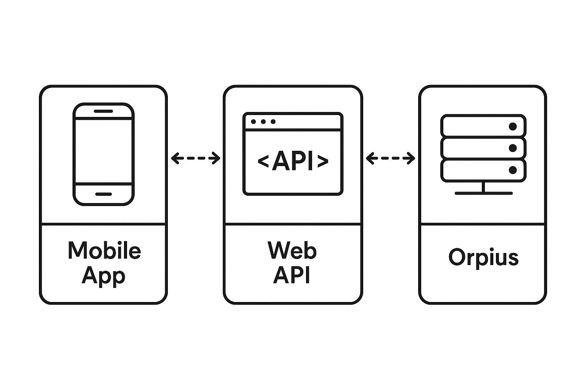

# Getting Started with the SDK

1. **Clone this repository**  
	```powershell
	git clone https://github.com/Orpius/SDK.git
	````

2. **Open the solution** in **Visual Studio 2022** (or later).

3. **Build and run** the sample application to confirm everything is working locally.
   By default, the sample project runs on:

	```
	https://localhost:7194
	```

---

If you haven't already, please read the [Operations section](../../UserGuide/Operations/)
of the user guide.

The [Orpius SDK repository](https://github.com/Orpius/SDK) contains varios sample projects.
This section focusses on the *Sample_AspNetCore_ProtobufNet* project 
and the *Sample_MobileApp_ProtobufNet* project.
The ASP.NET Core sample shows how to set up your own web application so that 
it can commicate with the Orpius server.
The MobileApp project demonstrates how you might create a mobile or desktop
app that communicates directly with your web API application, which relays
communication from Orpius. See below.



The Orpius SDK for .NET consists of a class library, 
*Orpius.Platform.ClientSdk.ProtobufNet*, which contains the types 
for creating and handling requests to and from the Orpius server;
and an Analyzer project, *Orpius.Platform.ClientSdk.ProtobufNet.Generators* 
that makes it easy to automatically generate 
nearly everything you need to provide your own custom APIs (tools) 
for your AI Agents to use.

The aforementioned libraries are both available as the following NuGet packages:

* [Orpius.Platform.ClientSdk.ProtobufNet](https://www.nuget.org/packages/Orpius.Platform.ClientSdk.ProtobufNet)
* [Orpius.Platform.ClientSdk.ProtobufNet.Generators](https://www.nuget.org/packages/Orpius.Platform.ClientSdk.ProtobufNet.Generators)

**Note:** Both libraries are currently available as pre-release packages, 
but will transition to release in the near future.


