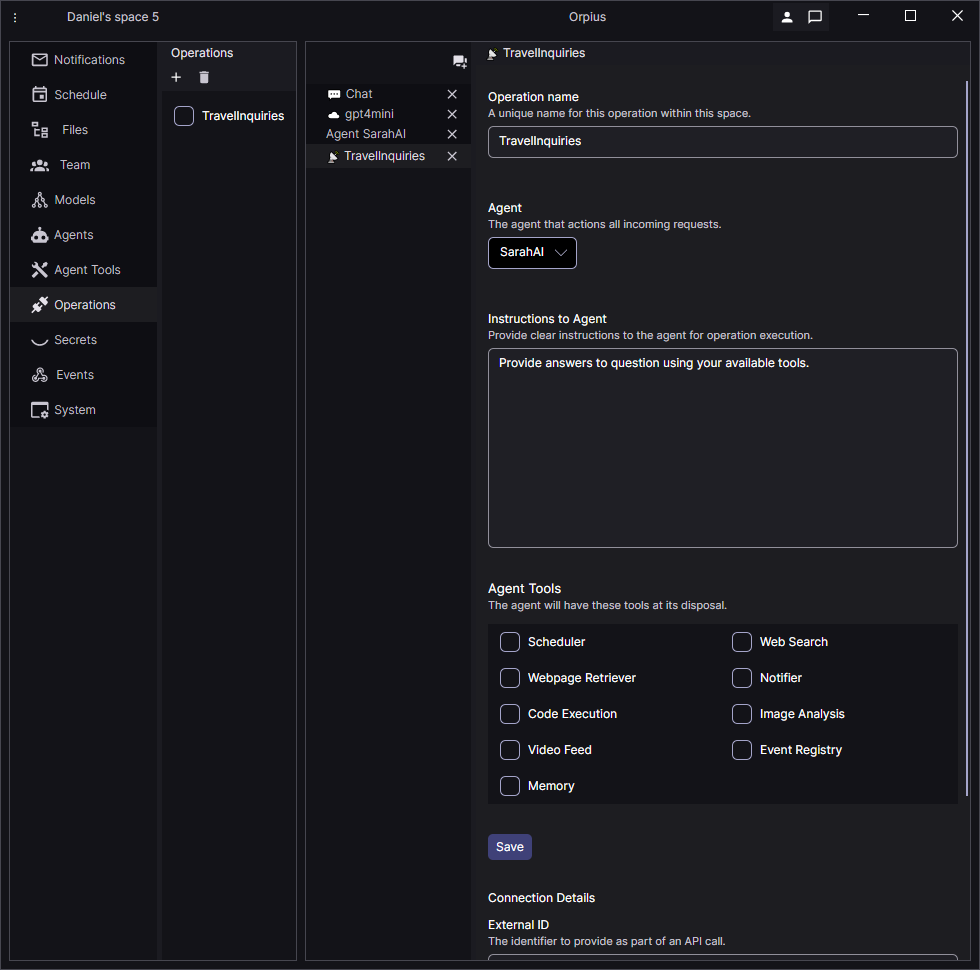
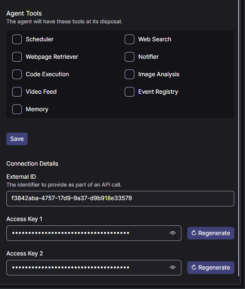

# Using Operations to connect your application to AI Agents

Operations allow your own application to communicate 
with your AI Agents that you have defined in Orpius.

In this section you see how to create an Operation.

You create a new Operation by selecting the '+' button in the toolbar
of the Operations view. See below.

The Operation contains an Agent field. 
The agent receives and processes incoming requests.

The Agent Tools section includes the built-in tools 
that can enabled or disabled for an agent.

Some built-in tools offer capabilities that you may 
not want to allow for a customer facing Operation.
The Code Execution plugin, for example, is able to write to isolated storage.
The Notification tool allows the agent awareness of team members and allows 
the agent to send notifications to team member; perhaps not something you'd want
external users having access to via your agent.
Therefore, all are disabled by default.

If your operation is not externally facing, then opening up the plugins
maybe something you would do.

Alternatively, instructing your agent to send an event, 
which can then be handled by a 'full-trust' agent like Phaedra,
is a way to seperate potentially dangerous activities from untrusted entities.

Upon saving the Operation, the External ID and Access Key properties
become available. See below.

You use the External ID when connecting
to Orpius from your application. The External ID identifies 
the Operation and the Access Keys allow access.
There are two Access Keys because it allows you to rotate one without having downtime.

Connecting to an Orpius Operation is covered in detail in the Development Guides.

With an Operation in place, your application is able to communicate
directly with your AI Agent; opening up all manner of captivating user experiences.

In addition to the built-in tools afforded by the Orpius platform,
you can enlist your own custom tools, located on your organization's network.

# Creating your own Custom Tools

To allow Orpius to call your tools, Orpius needs to know the **publicly reachable URL** of your server.
Since development machines usually run on `localhost`, we recommend creating a secure tunnel.

[Learn how to create a secure channel](../CreatingAChannel)

The programming language specific Operations Development Guides are:

* [Developer Guide for .NET](../../DevelopmentGuides/DotNet/)
* Developer Guide for Java (coming soon)
