# Orpius User Guide

<!--TOC-->
  - [Introducing Orpius](#introducing-orpius)
    - [For Developers](#for-developers)
    - [For Productivity and Operations Users](#for-productivity-and-operations-users)
    - [What Orpius Provides](#what-orpius-provides)
    - [Built-in Productivity Features](#built-in-productivity-features)
  - [Orpius Architectural Overview](#orpius-architectural-overview)
  - [How Orpius Protects Your Data](#how-orpius-protects-your-data)
    - [Tenancy and Isolation](#tenancy-and-isolation)
    - [Encryption at Rest](#encryption-at-rest)
    - [Encryption in Transit](#encryption-in-transit)
    - [Key Management](#key-management)
    - [Secrets and Sensitive Values](#secrets-and-sensitive-values)
    - [Data Sent to Model Providers](#data-sent-to-model-providers)
    - [Access Control and Identity](#access-control-and-identity)
    - [Auditing, Logging, and Monitoring](#auditing-logging-and-monitoring)
    - [Backups, DR, and Availability](#backups-dr-and-availability)
    - [Secure Code Execution](#secure-code-execution)
    - [Data Retention and Deletion](#data-retention-and-deletion)
    - [Compliance and Assurance (deployment-dependent)](#compliance-and-assurance-deployment-dependent)
    - [Security Quick Summary](#security-quick-summary)
  - [Getting Started with Orpius](#getting-started-with-orpius)
    - [From Configuration to Execution](#from-configuration-to-execution)
  - [Installing the Orpius Console](#installing-the-orpius-console)
  - [Setting up Orpius for the First Time](#setting-up-orpius-for-the-first-time)
    - [Setting up an Email Server (system owners only)](#setting-up-an-email-server-system-owners-only)
    - [Creating a User Account](#creating-a-user-account)
  - [Understanding the Orpius System Structure](#understanding-the-orpius-system-structure)
  - [Understanding User Roles](#understanding-user-roles)
    - [Space Roles](#space-roles)
    - [Organization Roles](#organization-roles)
  - [Navigating with the Orpius Console](#navigating-with-the-orpius-console)
    - [Understanding Spaces](#understanding-spaces)
      - [Creating a Space](#creating-a-space)
      - [Switching Between Spaces](#switching-between-spaces)
    - [Working with Large Language Models (LLM)](#working-with-large-language-models-llm)
      - [Configuring a New Model](#configuring-a-new-model)
  - [Understanding Agents](#understanding-agents)
  - [Configuring a Custom Agent](#configuring-a-custom-agent)
  - [Agent Tools](#agent-tools)
    - [Reviewing the Built-in Tools](#reviewing-the-built-in-tools)
    - [Custom Tools](#custom-tools)
      - [Custom Tool Integration Steps](#custom-tool-integration-steps)
  - [Using Secrets to Store Sensitive Information](#using-secrets-to-store-sensitive-information)
    - [Configuring a Secret](#configuring-a-secret)
    - [Using a Secret](#using-a-secret)
  - [Using Operations to Connect Your Application to AI Agents](#using-operations-to-connect-your-application-to-ai-agents)
    - [Creating Custom Tools for Operations](#creating-custom-tools-for-operations)
  - [Using Events to Trigger Activities](#using-events-to-trigger-activities)
    - [Creating an Event](#creating-an-event)
      - [Creating an Event via Chat](#creating-an-event-via-chat)
    - [Manual Creation of an Event](#manual-creation-of-an-event)
    - [Triggering an Event](#triggering-an-event)
    - [Editing Event Activities](#editing-event-activities)
      - [Example of Event Handling in an Orpius Powered Monitoring System](#example-of-event-handling-in-an-orpius-powered-monitoring-system)
    - [Events for Improving Security and Control](#events-for-improving-security-and-control)
    - [Passing HTTP Parameters to Events](#passing-http-parameters-to-events)
      - [Using HTTP GET to Trigger an Event](#using-http-get-to-trigger-an-event)
      - [Using HTTP POST to Trigger an Event](#using-http-post-to-trigger-an-event)
  - [Triggering Activities on a Schedule](#triggering-activities-on-a-schedule)
    - [Creating a Schedule](#creating-a-schedule)
  - [Understanding the Workflow and Activity Lifecycle](#understanding-the-workflow-and-activity-lifecycle)
    - [Activity Selection and Assignment](#activity-selection-and-assignment)
    - [Supervision and Tracking](#supervision-and-tracking)
    - [Automatic Verification](#automatic-verification)
  - [Agent Activity Auditing and Verification](#agent-activity-auditing-and-verification)
    - [How the Audit Works](#how-the-audit-works)
    - [Purpose of the Audit Step](#purpose-of-the-audit-step)
    - [Security and Privacy](#security-and-privacy)
    - [Benefits](#benefits)
  - [Working with Isolated Storage](#working-with-isolated-storage)
    - [Uploading files](#uploading-files)
    - [Downloading files](#downloading-files)
    - [Creating files using chat](#creating-files-using-chat)
  - [Using Team Collaboration and Management](#using-team-collaboration-and-management)
    - [Leveraging Team Awareness in an Interactive Chat](#leveraging-team-awareness-in-an-interactive-chat)
    - [Applying Team Awareness in Agent Activities](#applying-team-awareness-in-agent-activities)
  - [Adding Users to a Space](#adding-users-to-a-space)
    - [Steps to Add a User to a Space](#steps-to-add-a-user-to-a-space)
    - [Accepting an Invitation to Join a Space](#accepting-an-invitation-to-join-a-space)
    - [Managing User Limits (System Owners only)](#managing-user-limits-system-owners-only)
    - [Managing System Settings and Limits (System Owners only)](#managing-system-settings-and-limits-system-owners-only)
  - [Next Steps and Further Resources](#next-steps-and-further-resources)
<!--/TOC-->

## Introducing Orpius

Welcome to **Orpius** — the secure AI platform that gives you everything 
you need to integrate, build, and use generative AI in your systems
without the complexity of building and managing the underlying technology.

Security and privacy are built into Orpius from the ground up.
Data is secured both **at rest and in transit**, secrets are managed safely 
through dedicated tools that never expose them to models, and all server 
and internal components follow industry best practices for infrastructure 
and data protection.

### For Developers

Orpius provides a complete, **secure AI infrastructure** for adding 
intelligence to your applications — without engineering or maintaining 
the infrastructure yourself.

Use Orpius as a:

* **Foundation for integrating AI into existing applications**  
  Integrate models, automation, and intelligent processing into your existing systems.
  Orpius manages the infrastructure, data security, and communication pipelines,
  allowing you to focus on application design and functionality.

* **Foundation for developing new AI systems, applications, and tools**  
  Build AI-powered solutions from the ground up in a ready-to-use environment designed for rapid development, flexibility, and robust security.

### For Productivity and Operations Users

Orpius isn't just for developers — it's also a powerful productivity platform.

All configuration and management are handled through the **Orpius Console**,
a desktop client that runs on the same infrastructure as your applications.
The Console provides an interactive, chat-based interface that understands 
the system itself — allowing you to set up and manage AI agents, models,
schedules, events, and even your team without writing code.

### What Orpius Provides

Orpius provides a complete foundation for building AI applications.

It includes:

* **Integration with external systems** through API-driven events 
  or customer-facing AI agents.
* **Isolated code execution environment** – agents can write compilable code 
  and run it securely in a sandboxed environment.
* **Events** – agents are triggered by external systems or internal processes.
* **Notifications, messaging, and team awareness** – agents communicate 
  via notifications and email, and are time-zone aware, 
  enabling collaboration across teams.
* **Scheduling** – a flexible system for performing activities 
  at predefined times or intervals.
* **Memory** – agents manage their own memory, deciding what to retain 
  and when to use it.
* **Video feed image analysis** – analyze video streams in real time.
* **Web page retrieval** – extract information from web pages or APIs.
* **Custom agent creation** – define agents with specific personas 
  and instructions, targeting different language models.
* **Support for multiple LLM providers and formats** – use different models 
  for different agents.
* **Shared team storage** – share files and data between agents and team members.
* **Permissions and security** – control what agents and users can access or perform.
* **Secrets management** – handle sensitive information securely 
  without exposing it to language-model providers.
* **Orchestration** – manage complex workflows and interactions between agents.
* **Tool integration** – use built-in tools that provide core capabilities 
  out of the box, with powerful support for custom tooling.

### Built-in Productivity Features

The following examples show some of the productivity features available directly 
in the Console. They offer a glimpse of what you can accomplish 
in your own applications, though with custom tooling you can extend 
these capabilities much further.

For example, you can use chat in the Console to instruct Orpius to:

* Schedule and perform tasks
* Read, analyze, and write files
* Apply image analysis to video streams in real time
* Send emails and notifications to team members
* Organize meetings that suit everyone's time zone

## Orpius Architectural Overview

The Orpius platform is deployed as a single-tenant cloud service.
Support for on-premises deployments is planned.

The following diagram illustrates the high-level architecture of an Orpius deployment.
Each customer runs within a single-tenant environment, ensuring full isolation of compute,
storage, and secrets. The Orpius Console (desktop application) connects securely
to the Orpius Server, which manages authentication, scheduling, event handling,
and access to encrypted storage.
All sensitive operations—such as code execution, tool calls, and secret retrieval—occur
within this private environment.
Where a model provider is used (for example, OpenAI, Google Gemini, Azure OpenAI, on-prem),
Orpius connects through secure TLS channels while enforcing your chosen
data-handling policies.

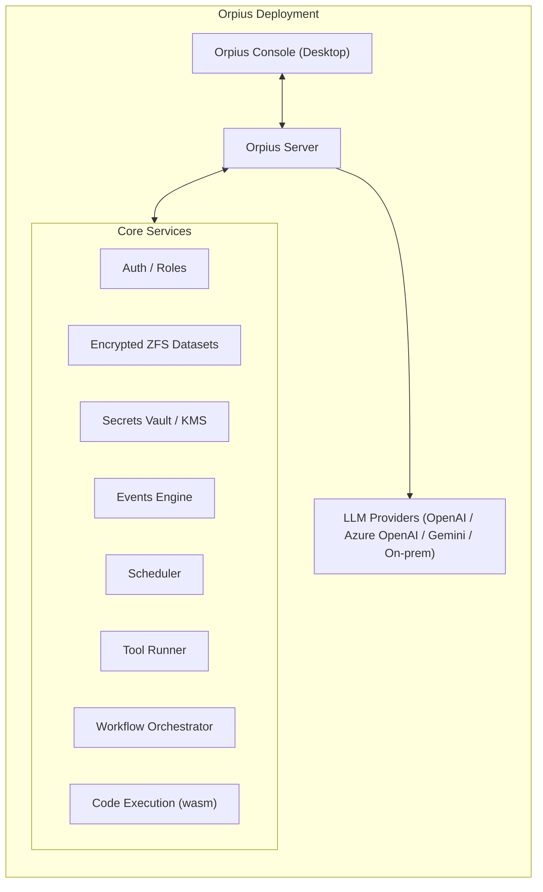

*Orpius groups everything you need—security, storage, tools, workflow, and optional LLM connectivity—inside a single-tenant boundary. The Console configures; the Server brokers; Core Services execute.*

> **Note:** A multitenant environment may be provided for evaluation 
and proof-of-concept testing.

## How Orpius Protects Your Data

Orpius is built with a defence-in-depth approach covering tenancy isolation, encryption, key management, access control, and operational safeguards. This section explains what happens to your data at rest, in transit, and while agents are running.

### Tenancy and Isolation

* **Single-tenant by design.** Each customer gets a dedicated Orpius deployment. No compute, storage, secrets, or configuration are shared across tenants.
* **Storage isolation.** Each tenant is provisioned with its own encrypted ZFS datasets. Files, models, logs, and cached artefacts for one tenant are not visible to others.
* **Process isolation.** Code execution (for tools and sandboxes) is confined to WebAssembly (Wasm) sandboxes with no access to other tenants' processes or storage.

### Encryption at Rest

* **ZFS native encryption.** All tenant datasets are encrypted using AES-256 (ZFS native encryption). Keys are unique per dataset and never reused across tenants.
* **Backups and snapshots.** Snapshots and off-box backups are encrypted before leaving the tenant host. Restores can only be performed with the tenant's keys.
* **Key rotation.** Dataset Encryption Keys (DEKs) are wrapped by a Key-Encryption Key (KEK). KEKs can be rotated without re-encrypting stored data.

### Encryption in Transit

* **TLS everywhere.** All network traffic between Console, Server, and internal services is protected with TLS (TLS 1.2+; TLS 1.3 preferred).
* **Strict ciphers and HSTS.** Strong cipher suites are enforced and HTTP is redirected to HTTPS with HSTS.
* **Mutual trust internally.** Internal service-to-service calls use authenticated channels and scoped service identities.

### Key Management

* **Per-tenant keys.** Every tenant has distinct KEKs; DEKs are generated per dataset/resource. Keys are never shared between tenants.
* **Hardware or cloud KMS.** Keys are stored in a secure keystore ([HSM/KMS, e.g. Azure Key Vault, AWS KMS]—configure per deployment).
* **Rotation and revocation.** KEKs can be rotated on a schedule or on demand. Access to retired keys is revoked immediately.

### Secrets and Sensitive Values

* **Secret references, not values.** When an agent speaks to a model, Orpius substitutes **secret references** (e.g. `<%=Key:WeatherKey%>`) in prompts. The real values are only resolved at tool-execution time inside Orpius, never in the model prompt.
* **Scoped retrieval.** Secrets are decrypted only when a permitted tool call requires them, and only for the duration of that call.
* **Auditability.** All secret access is logged with timestamp, requesting agent/tool, and outcome (without logging the secret value).

### Data Sent to Model Providers

* **Minimised prompt payloads.** Orpius strips secret values and any fields explicitly marked sensitive before sending prompts to model providers.
* **Provider controls.** You choose the model provider (e.g. OpenAI, Azure OpenAI, on-prem). Where supported, Orpius enforces provider settings to **disable training on your data** and uses private endpoints when available.
* **Regional routing.** Requests can be pinned to a region to help meet data-residency expectations ([set in System Settings → Inferencing]).

### Access Control and Identity

* **Role-based access.** Space and Organisation roles constrain who can view, configure, or execute agents, tools, events, operations, files, and logs.
* **Least privilege by default.** All built-in tools are disabled for customer-facing Operations until explicitly enabled.
* **Strong auth.** Support for email-verified accounts; SSO and MFA are planned/available depending on deployment ([SSO/MFA options here]).

### Auditing, Logging, and Monitoring

* **Tamper-evident logs.** Security-relevant events (auth, key use, secret access, tool execution, data export) are recorded with integrity protection.
* **Alerting.** Abnormal access patterns and repeated failures raise alerts to system owners.
* **Retention.** Log retention is configurable per tenant ([default N days]).

### Backups, DR, and Availability

* **Encrypted backups.** Backups inherit tenant encryption; keys never leave the keystore.
* **Restore testing.** Periodic test-restores validate that encrypted backups are recoverable.
* **High availability.** Core services run behind health-checked load balancers; background workers are horizontally scalable.

### Secure Code Execution

* **Wasm sandbox.** The CodeExecution tool runs user code inside a Wasm sandbox 
  with constrained CPU, memory, filesystem, and network policies.
* **No lateral movement.** Sandboxes cannot access other tenants' storage, processes, 
  or secrets unless a secret is explicitly granted to the tool call.
* **Egress control.** Outbound network access from sandboxes can be disabled or restricted to allow-lists.

### Data Retention and Deletion

* **System-wide retention controls.** **System Settings** include configurable data-retention periods that apply to spaces, files, logs, caches, and other artefacts.
* **LLM interaction retention.** Messages sent to and from model providers are retained **for 30 days by default** and **only** to let users resume conversations. They are **not** used for model training. You can shorten or extend this period (including retention-off) in **System Settings**.
* **You control retention.** Per-space policies can purge files, chat transcripts, tool outputs, and model caches after a defined period.
* **Right to delete.** When you delete a space or organisation, Orpius schedules a secure erase of the tenant datasets and removes all wrapped keys after the retention window closes.
* **Search indices and caches.** Derived artefacts (indexes, embeddings, caches) follow the same retention and deletion policies as the source data.
* **GDPR support.** Configurable retention, export on request, and secure deletion workflows support GDPR principles (purpose limitation, storage limitation, data minimisation) and user rights (access/erasure) for deployments that require them.

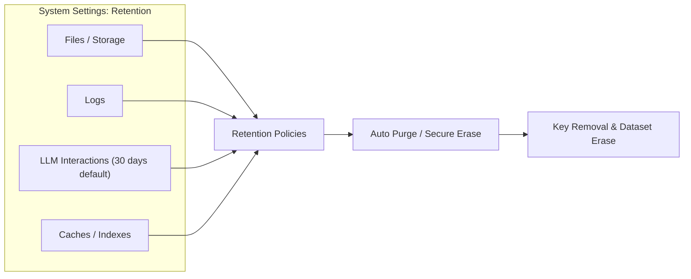

### Compliance and Assurance (deployment-dependent)

* **Change management.** Infrastructure and application changes are reviewed and tracked.
* **Vulnerability management.** Regular dependency scanning, OS patching, and penetration testing.
* **Compliance mappings.** Controls map to common frameworks (e.g. ISO 27001, SOC 2); attestations available on request for managed deployments.

### Security Quick Summary

* Separate, encrypted storage per tenant (AES-256 on ZFS).
* Distinct keys per tenant; secrets never sent to models.
* TLS in transit; Wasm sandbox for code.
* Least-privilege defaults; full audit trail.
* **LLM interactions kept 30 days by default for conversation continuity only. (deployment-dependent)**
* Encrypted backups; tested restores; configurable retention; **supports GDPR compliance**.

## Getting Started with Orpius

Before you can start working with Orpius, you will need:

* **Orpius Console** – A lightweight desktop client for configuring everything from models to agents and tools.
* **Access to your own LLM provider** – Orpius connects to the AI models you choose, whether hosted on-premises or in the cloud.
  It currently supports Google Gemini, OpenAI, Azure OpenAI, with more providers to follow.
  Many third-party providers also use the OpenAI Chat Completions format, making them compatible with Orpius.
* **Access to an Email Server (System Owners only)**  
  Because Orpius runs in your own private cloud, email handling is not provided 
  as a shared service. An email server is required during initial setup so new users 
  can verify their email addresses (a sending-only server is sufficient).
  It will also be used to send notifications or messages to team members. 

### From Configuration to Execution

1. **Configure** – Define your Models, Agents, Events, Tools, and Operations 
   in the Orpius Console. (You can think of Operations as the integration mechanism
   that allows your application to communicate with your Orpius AI Agents.)
2. **Integrate with your system** using events or with operations and tooling; using
   the Orpius SDK libraries, allowing you to embed your AI assistant directly 
   into your application.
3. **Execute** – The AI assistant can now call your server-side tools.
   The Orpius Server runs them and manages orchestration, integration, 
   state, storage, and security.

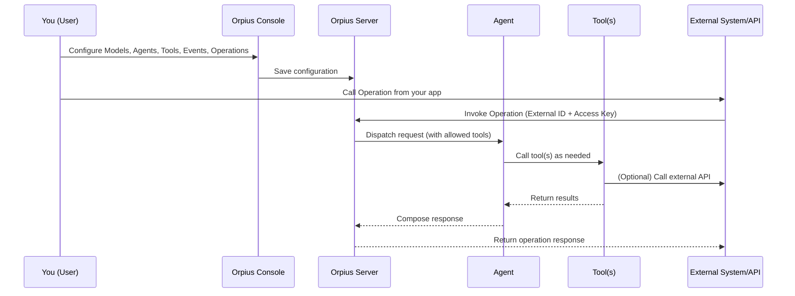

*Configuration to Execution (end-to-end flow)*

## Installing the Orpius Console

The Orpius Console is a lightweight desktop application 
that connects directly to the Orpius infrastructure.

To get started, you will receive a message from us containing:

1. A link to download the **Orpius Console**, resembling:
   `https://<YourAppName>.app.orpius.com/console/`
2. The Orpius Server URL.
3. Your Access Key (system owners only).

Follow these steps:

1. Open the download link and click **Download Orpius Console**.
2. Run the installer after the file finishes downloading.
3. Once installation is complete, launch the Orpius Console.
4. Enter the **Server URL** into the field provided.
5. Enter the **Access Key** (system owners only).

## Setting up Orpius for the First Time

If you are the system owner of an Orpius installation,
you will be prompted to set up the system the first time you launch the Orpius Console.

### Setting up an Email Server (system owners only)

During the first-time setup of the Orpius server, you will be prompted 
to enter your email server details.
The email server is used by Orpius to handle email requests 
such as sending messages to team members. 
Setting up the email server is required because it allows 
new users to verify an email address. 

Enter your email server details. 
You can update this information later in **System Settings** within the application.

### Creating a User Account

Every Orpius user creates and signs into a user account.

During the first time setup, you will be prompted to create your account.

* Enter your account **Username**, **Email**, **Given Name**,
  **Surname** and **Password** into the fields provided.

> **Note:** At present, account information can't be changed after your account is created. 
  Options to update these details will be available in an upcoming version.

You will receive a confirmation email from the system address you configured 
during email server setup (e.g. noreply@yourdomain.com) containing a code.

If you see an error message, click **Previous** and check that your email address 
and email server information are correct.

## Understanding the Orpius System Structure

Orpius is organized around organizations and spaces. 

At the top level is the **System**, which represents the Orpius installation itself.
Within the system, there are multiple organizations.

The **Organization** represents your company or organization.
Each organization has its own storage allocation, and set of members.

Each Organization contains one or more **Spaces**.
A Space is a dedicated workspace for a specific project or team.
Each Space contains all the resources for that project, 
such as agents, tools, models, operations, and events,
and has its own isolated storage area.

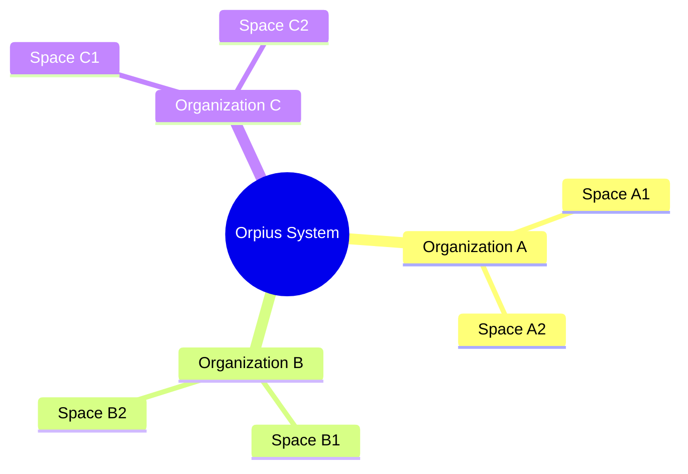

*The Orpius system contains organizations, which contain spaces*

For guidance on working within a **Space** in the Console, see [Understanding Spaces](#understanding-spaces)

> **Note:** When a user registers with Orpius, a default organization 
and space are created automatically for that user. 
You may invite other users to join your organization and collaborate in the same space.

## Understanding User Roles

A user may have different roles across different organizations and spaces.

### Space Roles
* **Participant** - Can receive notifications and perform tasks.
* **Editor** – Able to create and modify content and manage schedules and events in the space. 
* **Administrator** – Able to add new members and manage space settings.
* **Owner** – Able to delete the space or assign administrator privileges.

### Organization Roles
* **Participant** - A member of a space within the organization.
* **Administrator** – Able to add or remove members and manage organization settings.
* **Owner** – Able to delete the organization or assign administrator privileges.
  Able to manage language models.

## Navigating with the Orpius Console

After completing the initial setup, Orpius opens in the **Space Selector** view, 
where you can see a list of the Spaces you belong to. 
Each user begins with a default Space that is created automatically. 

### Understanding Spaces

A space is your working area inside the Orpius Console. 
Each space keeps everything related to a project or team in one place. 
You can also invite members (inside or outside your organization) to collaborate 
in a space. Members can be invited into a space and granted access through roles.

Your Spaces are listed on the Space Selector view, where you can:

* **Open** an existing space
* **Create** a new space
* **Delete** a space

Within a Space, you can:

* View **notifications**
* View and manage **scheduled tasks**
* Upload and download **files** to and from your isolated storage
* Invite and manage **members** for collaboration
* Configure your models, agents, tools, operations, secrets, and events
* Interact with AI agents via chat 

#### Creating a Space

To create a new Space:
1. From the **Organization View** page, select **Create a Space**.
2. Enter a name for the Space. 
3. Confirm to create.

#### Switching Between Spaces

To switch to another **Space**, sign out of your current session.
When you sign back in, the **Organisation View** opens and lets you choose a different **Space**.

### Working with Large Language Models (LLM)

The system is designed to work with any LLM, whether hosted **on-premises** 
or in the **cloud**.
Currently, OpenAI, Azure OpenAI, and Google Gemini are supported, with more providers to follow.
Many providers already support the OpenAI Chat Completions format, making them compatible with Orpius.

You can configure as many models as you need, from different providers. 
For example, some agents might use GPT-4o for complex tasks, 
while others can run on a lower-cost model such as OpenAI gpt-4o-mini.

> **Caution:** When your system is configured for unattended execution, 
  such as for scheduled tasks, events or operations, 
  it may continue to consume resources and incur costs even when no users 
  are actively connected.

> **Tip:** Google provides free API access to its [Gemini model API](https://ai.google.dev/gemini-api/docs/api-key),
  which is useful for getting started with Orpius.

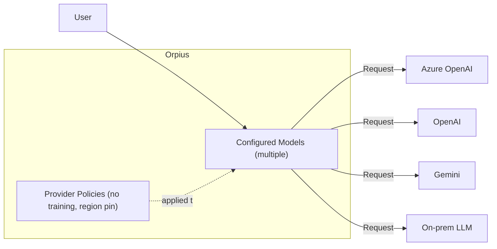

#### Configuring a New Model

1. Open the **Models** view from the sidebar 
2. Select the **Add** (**+**) button in the toolbar of the **Models** view
3. Enter the required information
4. Save

## Understanding Agents

In Orpius, agents are considered users, just like humans. 
Orpius includes two built-in agents: **Orpius** and **Phaedra**.
* **Orpius** is the agent you interact with directly through chat, and who orchestrates non-interactive activities.
* **Phaedra** carries out non-interactive activities, such as scheduled tasks and event execution.

Both Orpius and Phaedra are **organization-wide** agents available in every space.
In addition, you can create **custom agents** dedicated to specific operations within a space,
allowing you to provide a custom persona and instructions to your agent.

By default, Orpius and Phaedra use the first LLM you define, 
but you can assign them to any of your available LLMs.


Agents in Orpius do not have fixed tools or workflows of their own.
Instead, they draw from a shared pool of tools.

When integrating your application with Orpius, 
you configure a **Custom Agent**. This agent will handle all incoming requests 
from your application.

## Configuring a Custom Agent

To create a custom agent, perform the following steps:

1. Open the **Agents** view from the sidebar 
2. Select **'+'** button in the toolbar of the **Agents** view
3. Give the Agent a **Name**
4. Select a suitable **Model** for your Agent
5. Define the Agent's **Persona**
6. Set the Agent's **Temperature**
7. Provide further **Instructions** that will assist the agent in carrying out its duties.
8. Save.


*Configuring a custom agent*

## Agent Tools

Tools are functions that your agent can call to perform specific tasks.
Tools in Orpius are not tied to a single agent.
They live in a shared pool that any agent can access if it has permission.
Tools can be combined, triggered by events, and reused across different agents.
Agents can autonomously select and combine the tools they need to complete a task.

Tools can be either built-in or custom.

The diagram below illustrates how Agent Tools operate within Orpius.
All built-in tools—such as the Scheduler, Notifier, WebPageRetriever, and CodeExecution—are system-wide features that are configured at the organisation level.
*Organization Administrators* can enable or disable specific built-in tools.
When you create a **Operation**, you can selectively grant access to any of these built-in tools for that **Operation**.
Your custom agent will then be given access to the built-in tool during the *Operation*.
This structure ensures consistent capability management across the organisation while maintaining fine-grained control over what each agent can perform.

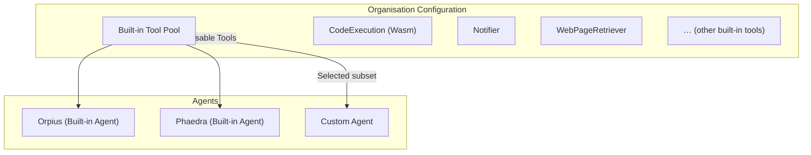

*Built-in Tool Use*

**Custom tools** are provided by **customer-hosted or third-party servers** that register with Orpius as **tool providers**.
These tools are **ephemeral**—they are not stored or managed within a space—but can be **made available to built-in or custom agents** when they are online and registered.
When your application calls an **Operation endpoint** in Orpius, it must **explicitly specify which custom tools are permitted** for that call.
This ensures that only the declared tools can be invoked during the request, providing fine-grained control, isolation, and clear auditability for every interaction.
For more information on registering tool providers and specifying tools in operation calls, see the [Orpius SDK Developer Guide](../DevelopmentGuides/index.md).

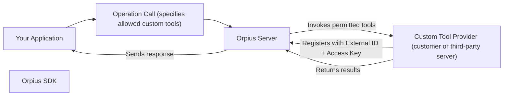

*Custom tools are provided by customer-hosted or third-party servers*

### Reviewing the Built-in Tools

Orpius includes the following set of built-in tools:

* **Scheduler** – Allows an AI agent to add work items to be done at a future time. 
  Schedules can be of the type:
  * **Daily** - to run at a specified time
  * **Weekly** - to run on a specified day of the week and specified time
  * **Monthly** – to run on a specified day of the month and time
  * **Yearly** - to run on a specified day of the month and time
  * **Interval** - to run after a specified period and may be set to repeat forever 
    or loop for a specified number of times.
* **WebPageRetriever** – Retrieve the HTTP response for a specified URL. 
  Allows for the use of web APIs.
* **WebSearch** – Allows an AI agent to search the internet. A search provider API key is required.
* **Notifier** – Send notifications to a user. A notification may also be sent by email to the user.
  The user's email is never provided to an agent.
* **CodeExecution** – Compiles and runs managed code and passes the results back to the agent.
  This allows the assistant to complete tasks that require calculations, 
  storing and retrieving data from files, or calling third-party APIs.
  The execution environment is sandboxed and hosted within WebAssembly (Wasm), 
  isolating it from other processes or code execution.
* **ImageAnalysis** – Allows an agent to analyze an image, 
  either from a specified image URL or by snapping a frame from a real-time video stream. 
* **VideoFeedMonitor** – Connects to a real-time streaming protocol (RTSP) feed and captures a still image for analysis.
* **EventRegistry** – Registers an event name that can be used by a remote API to trigger a task. The identifier can then be used with a web hook in the system.
* **Memory** – Allows an agent to add a record of an event or experience to the agents memory store, enabling it to track changes across multiple tasks.
* **EventTrigger** - Triggers an event that was previously registered.

The following **example** shows how a simple instruction can lead 
the agent to **autonomously** combine **multiple tools** to complete the task.

**Prompt:**

>*Add a scheduled item for every 5 minutes to analyze rtsp://orpius:<%=Key:WebCam%>@CAMERA_IP:554/cam/realmonitor?channel=1&subtype=0. Please record the car colors and their position in the bays to a csv file named 'parking.csv' by appending to the file. If it doesn't exist, create it with the column headers. If it already exists then append the data to the file without the headers.
Include a row for each car you see. Notify John if cars are parked in the restricted space.*

**What the agent does:**
1. Attends to the task every five minutes **(Scheduler)**
2. Retrieves the video stream URL **(Secrets)**
3. Connects to the video stream **(VideoFeedMonitor)**
4. Analyzes the image to detect parked cars **(ImageAnalysis)**
5. Writes the findings to a file **(CodeExecution)**
6. Notifies the user if an issue is detected **(Notifier)**

> **Tip:** When scheduling an activity, be specific about the number of times 
  you want the activity to run, or whether it should repeat indefinitely. 
  The repetition count and the maximum number of repetitions is shown in the **Schedule** view.
  If not present, it indicates that the activity will run indefinitely.

  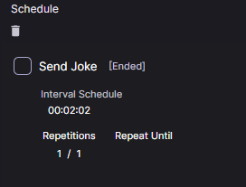

  *Schedule Repetitions*

### Custom Tools

In addition to the built-in tools, you can register your own custom tools 
located within your organization's network or on another external system.
Custom tools extend Orpius with domain-specific capabilities 
that your agents can use during inferencing.

**Custom tools** can expose almost any functionality available within your environment. 

For example, you can create tools that:

* Connect to your organization's database 

* Access internal APIs 

* Perform domain-specific calculations or lookups, such as pricing estimates, scheduling logic, or engineering models.

* Interface with third-party systems (e.g., ERP, CRM, or ticketing platforms) through secure API calls.

* Trigger automation tasks such as sending notifications, generating reports, or updating shared files.

Each custom tool is registered in the system with a unique name 
and made available to AI Agents under your control. 
This allows agents to call your organization's existing code, libraries, 
or services securely—without exposing them externally.

#### Custom Tool Integration Steps

1. **Register a custom tool** – Open the **Agent Tools** view from the sidebar and select **Custom Tools** .
2. **Integrate with your application** – Copy the **External ID** and **Access Key**, then paste them into **your application**.
3. **Expose functionality to Orpius** – Decorate your code with the [Tool] and [ToolMethod] attributes.
4. **Execute** – The Orpius SDK automatically receives and dispatches tool requests at runtime.

For a deep dive into custom tools, see the [SDK documentation](../DevelopmentGuides/index.md) for more details on custom tools. 
Example implementations are included in the downloadable SDK.

## Using Secrets to Store Sensitive Information

Secrets are used to securely store sensitive information such as API keys,
tokens, or passwords. These secrets can then be referenced in chat, code,
or tool calls without exposing their actual values to language model providers.

When interacting with an LLM provider, the system sends the **secret reference**
(e.g., **<%=Key:SecretName%>**) rather than the actual value.
The value itself is only resolved at runtime by the system when needed
for a tool call.

> **Note:** If a secret value is returned from an API or other external service
as part of the agent's output, it may become visible to the LLM provider.
Avoid exposing secret values in responses or messages wherever possible.

This mechanism helps ensure that **sensitive data** is **not hardcoded**
and remains protected throughout normal operation.

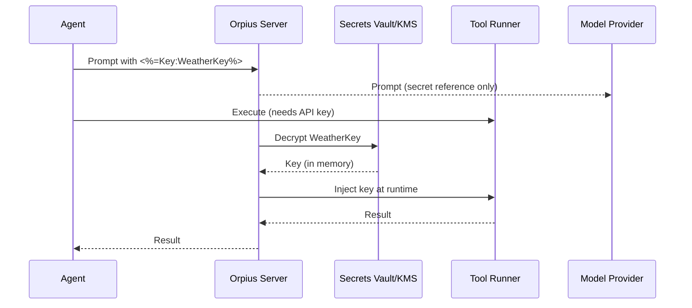

### Configuring a Secret

To create a new **Secret**:

1. Open the **Secrets** view from the sidebar
2. Select the **Add** (**+**) button in the toolbar of the Secrets view
3. Enter the **Token**, the **Secret Value** and a **Description**
4. Save your changes

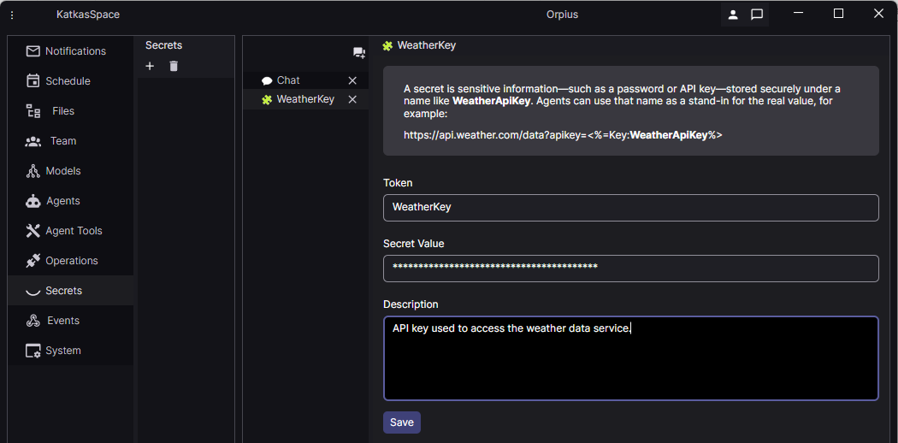

### Using a Secret

Suppose you have an API key stored as a **Secret** named **WeatherKey**. 
In your instructions to an agent, you would reference it 
like this: **<%=Key:WeatherKey%>**.

For example, you might instruct the agent to:
```
Fetch the current weather 
from https://www.weatherserviceexample.com?apikey=<%=Key:WeatherKey%>
```

When the agent executes this instruction by calling a tool,
the Orpius system replaces the secret reference with the actual API key value. 
This allows the API key to be securely injected
at runtime without being exposed to the LLM provider.

## Using Operations to Connect Your Application to AI Agents

Operations allow your own application to communicate directly 
with agents defined in Orpius.

To create a new Operation:

1. Open the **Operations** view from the sidebar.
2. Select the **'+'** button in the toolbar of the Operations view.
3. Choose the **Agent** that will receive and process incoming requests.
4. Configure any **Agent Tools** that the Operation may use.
5. Save.

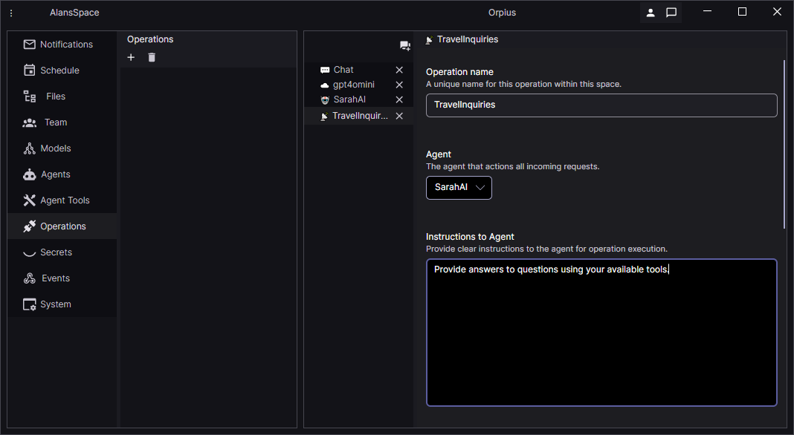

*Define an Operation*

The **Agent Tools** section lists the built-in tools available to the selected Agent.
You can enable or disable individual tools depending on the purpose of the Operation.

Some built-in tools, such as **Code Execution** or **Notifier**, 
may expose capabilities that are not suitable for customer-facing Operations.
For example, the Code Execution tool can write to isolated storage, 
and the Notifier tool provides awareness of team members.
For security reasons, all tools are disabled by default.

> **Note:** If you plan to allow your agent to trigger events, 
  enable the **EventTrigger** tool.

If the Operation is not externally facing, you may enable additional tools as required.
Alternatively, you can instruct an agent to raise an **Event** 
that is handled by a full-trust agent such as *Phaedra*.
This approach separates potentially sensitive activities from untrusted entities.
This is discussed in more detail in the [Events](#events-for-improving-security-and-control) section.

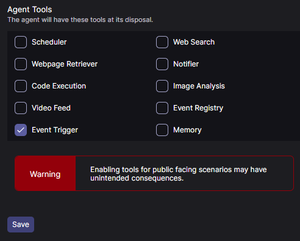

After saving the Operation, the **External ID** and **Access Key** properties 
become available.

These values are used when connecting from your own application:

* The **External ID** identifies the Operation within Orpius.
* The **Access Keys** allow authenticated access.
  Two keys are provided so that one can be rotated without downtime.

Connecting to an Orpius Operation is covered in detail in the **Development Guides**.


*Fields become available once the operation is saved*

With an Operation in place, your application can communicate directly 
with an AI Agent through the Orpius platform.

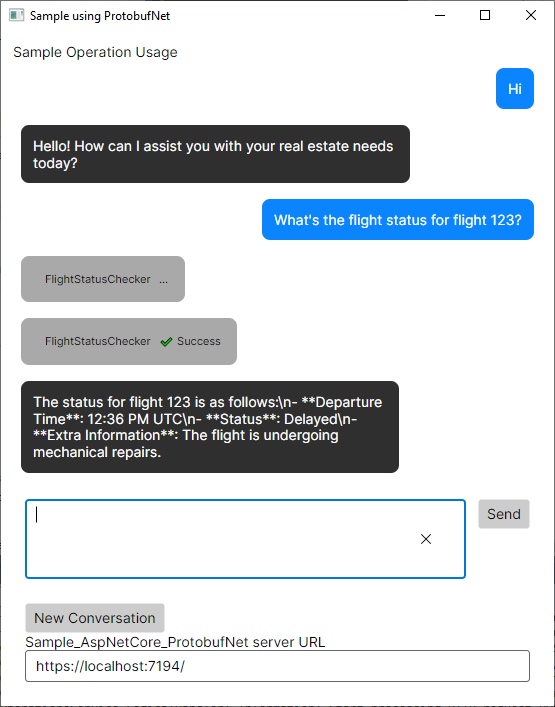

*Sample application communicating with an Orpius Operation*

### Creating Custom Tools for Operations

In addition to the built-in tools provided by Orpius, you can register 
your own custom tools hosted within your organisation's network.

To allow Orpius to call your tools, the system must know 
the **publicly reachable URL** of your server. Because development environments 
often run on `localhost`, we recommend creating a secure tunnel.

[Learn how to create a secure channel](CreatingAChannel/index.md)

> For language-specific setup and APIs, visit the [Development Guides](../DevelopmentGuides/index.md).

## Using Events to Trigger Activities

Events provide a secure and flexible way to connect your systems with Orpius.
An **event** represents something that has occurred — either **externally** 
(for example, from your application or a monitoring system) or **internally** (from an agent or activity inside Orpius).
When triggered, an event causes one or more **activities** to run automatically within its space.

Events can therefore be used to:

* React to real-world or system events (for example, an incoming webhook or sensor signal)
* Allow agents to chain actions together (for example, *"if this happens, trigger that event"*)
* Safely delegate actions to another agent or system with different permissions

### Creating an Event

There are two ways to define an event in Orpius: manually or through chat.

#### Creating an Event via Chat

Orpius understands what events are, and can be instructed through chat 
to create new events with specific actions.

* Start a new **Chat** 
* For example, you could say: *"Create an event named 'FactoryUnitArrived' 
  that notifies the user robertB with the order details."*
* Orpius will then register the event and set up the event activity instructions accordingly, 
  including your username for proper execution.
* Open the **Events** view to review or modify the newly created event.

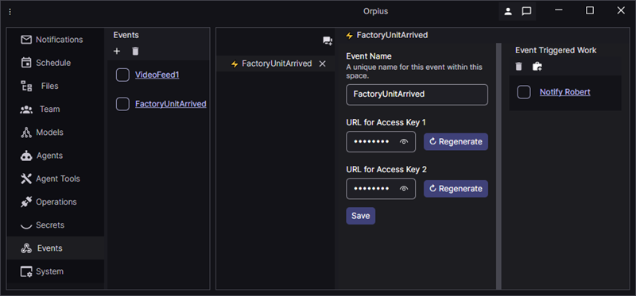

**Creating an event**

> **Caution:** When defining activities triggered by an event, 
  avoid wording that suggests creating or scheduling an event in the task instruction.
  The agent may interpret this as a command to create a new event each time it runs.
  Instead, phrase the instruction as an immediate action, and review the event activity 
  after creation to ensure it aligns with your intent.

### Manual Creation of an Event

To create an event manually, follow these steps:

1. **Register the Event**
    * Open the **Events** view from the sidebar.
    * Select the **'+'** button in the toolbar of the **Events** view
    * In the **Event Configuration** view, enter the event name (for example, *FactoryUnitArrived*).
2. **Define the Triggered Work (Activity)**
    * In the **Event Triggered Work** view, select the **'+'** button 
      in the toolbar of the **Event Triggered Work** view.
    * Provide a **Title** and clear **Instructions** for the agent 
      (for example, *"send a notification to the user with username robertB"*).
    * You can define multiple activities for the same event.
    * Allow the use of custom tools that the agent can use when executing the task.
3. **Trigger and Execute**
    * When an external system fires the *FactoryUnitArrived* event, 
      an agent automatically executes the defined activity.

### Triggering an Event

An event in Orpius can be triggered in two distinct ways:

1. **Externally** — by calling its unique **HTTP endpoint** from another system or application.
2. **Internally** — by **name**, using the **EventTrigger tool** from within any activity,
   schedule, or operation in the same space.

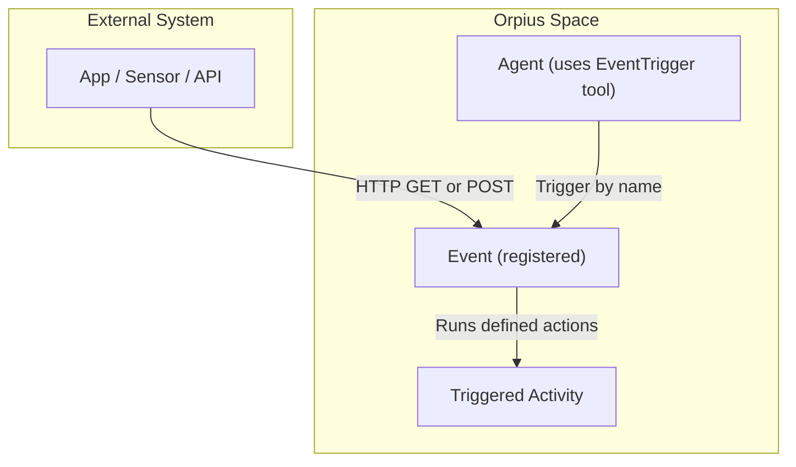

*Trigger an Event by External URL or Internal Name*

This dual triggering mechanism allows powerful, composable workflows.
For example, an agent performing an analysis task might detect an anomaly 
and then use the **EventTrigger tool** to raise an internal event — causing 
another agent to send alerts or collect data.

You can also instruct an agent to trigger **external events** by using 
the **full HTTP endpoint**, allowing cross-space, cross-organisation, or even cross-Orpius-system communication.

Built-in agents as well as your custom agents can trigger events.
You can instruct Orpius, in a chat, to trigger an event by name.
You can instruct your custom agent to trigger an event as part of an operation.
Events can be triggered in scheduled tasks, operations, directly via a chat, 
or even conditionally during another event activity.

### Editing Event Activities

Upon registering an event, you add the activities or follow-up events 
that should run when the event is triggered.
When the event is triggered, an agent performs the associated activities.

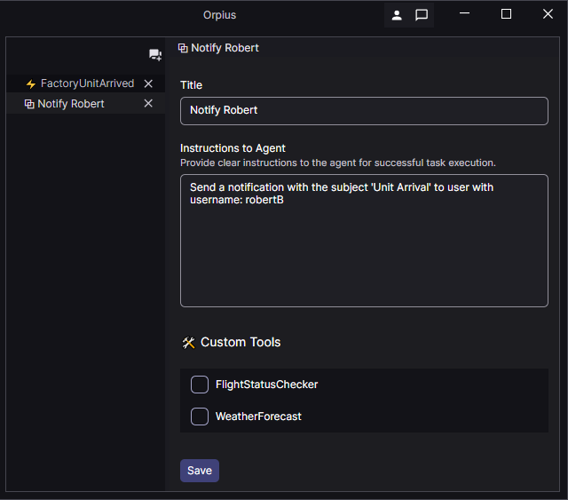

**Editing an event activity**

By clicking and expanding the **URL for Access Key 1** or **URL for Access Key 2**,
you can see the full URL to call the event.
The purpose of having two access keys is to allow you to rotate one key
without having downtime.

For example, given a different base URL for an Orpius application you
will see something like:
```
https://nyfqg7nhtfak2vj6kjslml4lrk.app.orpius.com/api/v1/event/raise?event-id=a1267fa8ce2a20734536920ebdffa262
```
When called with a HTTP GET or POST request, this will trigger the event whose ID is *a1267fa8ce2a20734536920ebdffa262*.

The query string, which includes the 'event-id' parameter,
also allows you to pass additional parameters to the agent and to your tools.

#### Example of Event Handling in an Orpius Powered Monitoring System

* A camera sends a motion detected event. 
* You configure this event to trigger an activity with instructions 
  that are given to an agent.
* Upon the event, the agent orchestrates the response: 
  it launches the analysis, notifies the right user, and, 
  depending on the outcome, can automatically trigger follow-up actions 
  such as raising an alert, starting a recording, or handing off to another tool.

> **Note:** Currently, events are handled by the built-in Orpius agents only.
  We plan to extend this functionality to custom agents in a future release.

### Events for Improving Security and Control

Orpius is designed to be adaptive rather than follow rigid workflows. 
To keep this behaviour reliable, you can set **guardrails** by defining 
which **tools** and **constraints** an agent is allowed to use.

The event system can also provide a built-in **security layer** based 
on the principle of Segregation of Duties (SoD).
Customer-facing agents can trigger events to request actions 
from more privileged agents, without having direct access to sensitive capabilities 
such as scheduling, storage, or team information.

### Passing HTTP Parameters to Events

When an event is triggered, you can pass additional parameters
that are provided either to your tools only, or to your tools and your agent.

Key value pairs are passed in the query string for both **GET** and **POST** requests.
In addition, for **POST** requests, raw JSON can also be passed directly to the agent
in the body of the request.

#### Using HTTP GET to Trigger an Event
* Query string keys that are prefixed with an underscore ( _ ) 
  are passed to your tools only.
* Query string keys that are not prefixed with an underscore 
  are passed to both your tools and the agent.

#### Using HTTP POST to Trigger an Event

When using POST all key/value pairs (apart from the **event-id**) are supplied 
in the context object of your tools.

To see more information on the context property see 
*[Including Call Specific Information in a Chat](../DevelopmentGuides/DotNet/index.md#including-call-specific-information-in-a-chat)* in the Developer Guide.

## Triggering Activities on a Schedule

**Schedules** allow you to define **when** an activity should occur.
Once created, Orpius automatically manages the execution lifecycle:
the **Scheduler** queues the task, and when the scheduled time arrives, 
**Orpius selects the most suitable agent** — based on 
its **profile, availability, and assigned permissions** — to carry out the work.
After execution, an internal **audit agent** independently verifies 
that the task met its intended objective.

This automated orchestration ensures that work runs reliably, securely, 
and under the correct operational context, without requiring manual intervention.

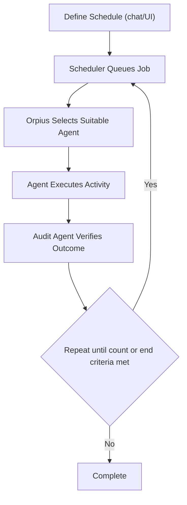

*Scheduled activity lifecycle: Orpius queues, assigns, executes, and audits tasks automatically.*

> **Note:** Activities are also triggered by Events, which are covered in the previous section.

### Creating a Schedule

You can create a schedule directly in chat.

* Start a new **Chat** 
* For example, you could say: *"Please schedule an item to send me a joke every 2 minutes."*
* Orpius will create a **scheduled task**, which you can then review, edit, or delete in the **Schedule** view.
* Open the **Schedule** view to review or modify the newly created schedule.

> **Tip:** Be wary that running a task at very short intervals (such as every 2 minutes) can increase resource usage and cost. You should specify how many times the activity should repeat; otherwise, it will run indefinitely.

## Understanding the Workflow and Activity Lifecycle

Every activity in Orpius—whether triggered by an **event** or a **schedule**, 
is managed by a dynamic **workflow orchestration system**.
This system determines *what work must be done*, *who should do it*, 
and *how the result is verified*.

When a new task arrives, Orpius places it into an **internal activity queue**.
From there, the **Workflow Orchestrator** analyses the task requirements, 
evaluates which agents have the necessary tools and permissions, and selects 
the most suitable agent to perform it.
Once selected, that agent executes the activity under supervision, 
and the outcome is recorded for audit and review.

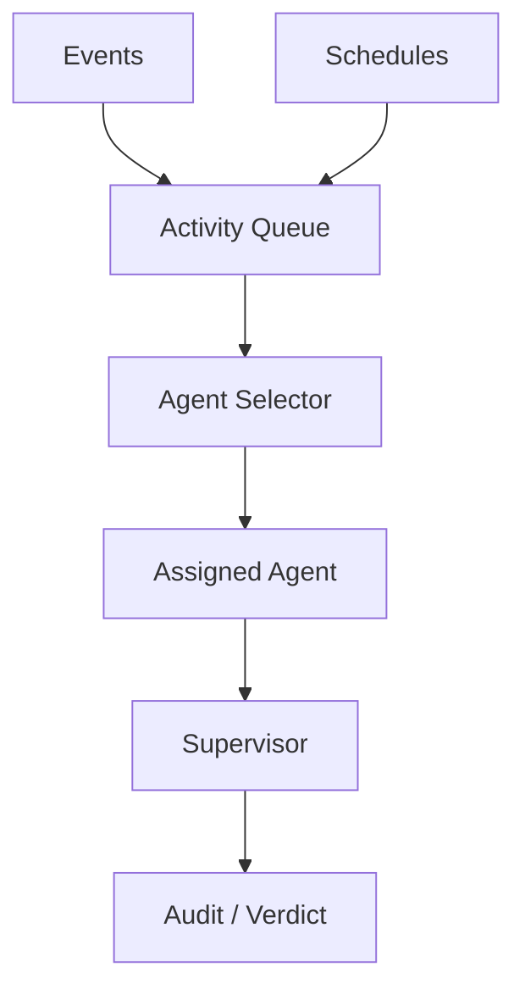

*Workflow orchestration and activity lifecycle.*

### Activity Selection and Assignment

* **Event-triggered activities** – generated by named events within a space.
* **Scheduled activities** – queued by the Scheduler to run at defined times or intervals.

The **Agent Selector** determines which agent is most appropriate to handle each activity.
Selection is based on:

* the agent's **assigned permissions** and accessible tools
* its **availability** and current workload
* any **role or profile constraints** defined in the space configuration

Once selected, the activity is handed to the agent for execution.

### Supervision and Tracking

During execution, a **Supervisor** process tracks progress, timeouts, 
and runtime limits.
If an agent encounters an error, exceeds policy limits, or becomes unresponsive, 
the Supervisor terminates the task and records the state for later analysis.
All results—successful or not—are logged with the initiating context, 
timestamps, and any generated artefacts.

### Automatic Verification

After completion, the activity and its output are passed 
to the internal **Audit Agent**, which reviews whether the outcome appears 
to satisfy the stated objective.
The audit verdict ("Yes" or "No") and all related artefacts are stored 
in the system's immutable audit log.

## Agent Activity Auditing and Verification

To ensure that every automated activity in Orpius performs as intended, 
the platform includes an internal audit mechanism.
After an agent completes a task—whether scheduled, triggered by an event, 
or invoked through an operation—an internal audit step runs automatically 
to verify the outcome.

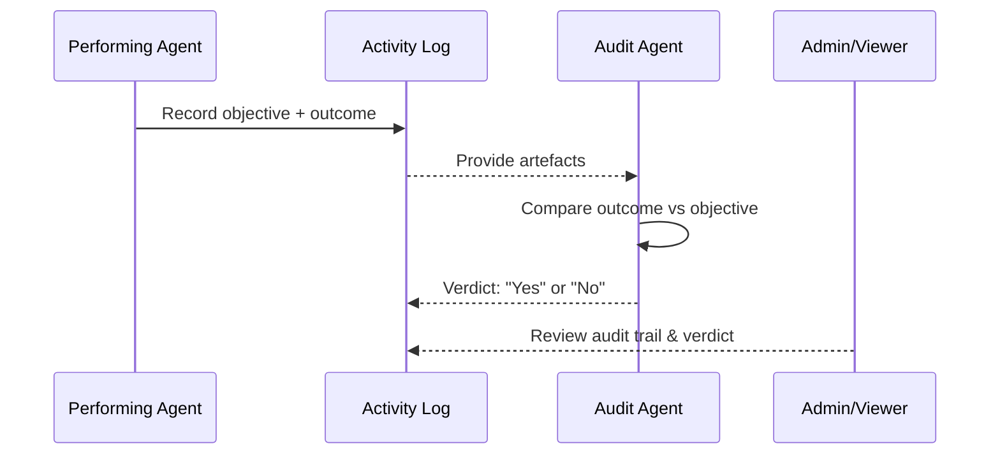

### How the Audit Works

1. When an agent finishes an activity, Orpius records the **original instructions** (objective) and the **observed outcome**.
2. A separate internal **audit agent** then examines these artefacts.
3. The audit agent independently evaluates whether the outcome appears to meet 
   the stated objective and records a simple verdict of **"Yes"** or **"No."**

### Purpose of the Audit Step

* **Integrity and reliability.** Confirms that AI-driven activities complete as requested.
* **Automated oversight.** Provides continuous self-assessment without human review.
* **Error detection.** Highlights potential failures or incomplete results.
* **Traceability.** The audit record, verdict, and related context are logged for review 
  in the system's audit trail.

### Security and Privacy

* The audit agent operates **entirely within your Orpius deployment** and uses the same encryption and isolation protections as other components.
* No data from this process is shared externally or sent to language-model providers.
* Audit results are **immutable** and form part of the tamper-evident log history used for compliance and diagnostics.

### Benefits

This built-in verification mechanism ensures that AI agents in Orpius 
remain **accountable, observable, and auditable**.
It strengthens confidence in autonomous operations, supports internal 
governance processes, and contributes to compliance assurance frameworks 
such as **GDPR**, **ISO 27001**, and **SOC 2**.

## Working with Isolated Storage

Each space has its own isolated storage area.

Files uploaded to isolated storage are available exclusively 
to users and agents operating within the same space. 
This provides a secure way to share data, documents, and other resources
with agents and users on your team.

Agents can read, write, and modify files within this storage.

For example, you could upload a sales report and ask Orpius:

*"Summarise the key trends from last quarter's sales and write the summary to a file called SalesSummary.txt. If the file already exists, append to it."*

Access to files within a space is controlled by permission levels. 
Users with a space role above **Editor** have access to files in that space.

### Uploading files

* Open the **Files** view from the sidebar
* Click the **Upload** button in the toolbar of the **Files** view 
  and select the files you want to upload
* Click **Open**

### Downloading files

* Open the **Files** view from the sidebar
* Select the file(s) you wish to download and click the **Download** button in the toolbar of the **Files** view
* Choose the folder where you want the files saved

### Creating files using chat

Orpius can create a wide variety of file types.
Common examples include:

* text files (e.g. .txt, .csv)
* code files (e.g. .cs, .py, .js)
* document files (e.g. .md, .html)
* data files (e.g. .json, .xml)

Start a new **Chat**. Then, for example, you might enter:
*"Create a file called test.txt and insert 10 city names."*
Orpius will create a new file named *test.txt* containing 
the 10 city names and save it in your isolated storage directory.

## Using Team Collaboration and Management

An organization can contain multiple spaces, and each space can have 
as many users as needed.

Orpius provides team collaboration across time zones;
agents are aware of the time zone of each team member.
This allows agents to coordinate activities based on expected working hours for example.
Agents with access to the Notifier tool gain this team awareness;
allowing them to notify other team members during an activity.

This same awareness also enables **Orpius to make informed decisions**
about **who is best placed to action time-critical activities** — such as assigning
urgent requests or service tasks to the most appropriate, available team member in a services-based environment.

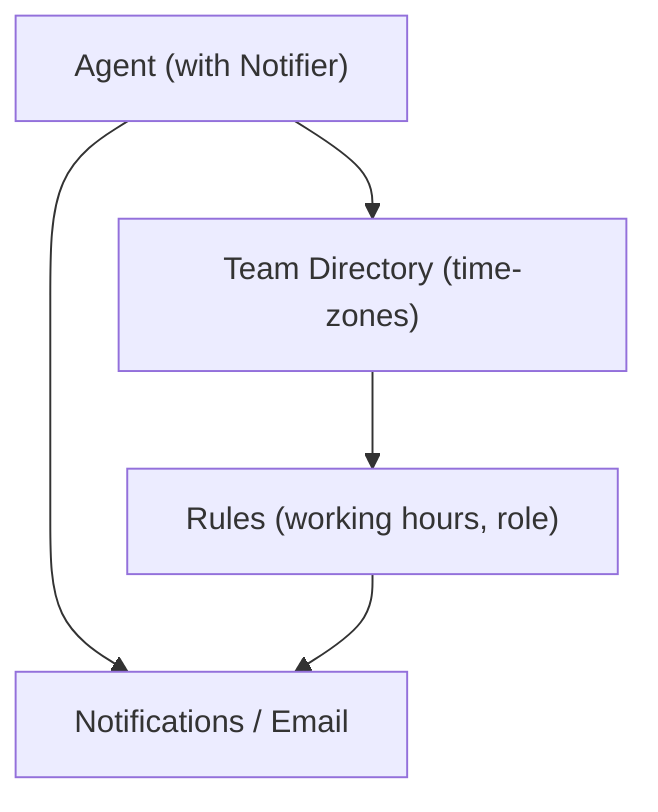

### Leveraging Team Awareness in an Interactive Chat

You can use team awareness within the chat interface by asking, "Who is on my team?"
Orpius will respond with an up-to-date list of your team members.

Alternatively, you might say, "Please thank John for completing the quarterly report."
Orpius will automatically send John both an email and an in-app notification on your behalf.

### Applying Team Awareness in Agent Activities

Team awareness also applies in non-interactive scenarios such as scheduled activities, 
event activities, or in operations (where the Notifier tool is enabled).
For example, when an event activity is created or updated, Orpius can automatically 
identify relevant team members-based on predefined rules or business logic-and notify 
them through email or in-app messages.
This ensures that key stakeholders remain informed and that operational communication 
occurs seamlessly, without the need for manual intervention.

## Adding Users to a Space

Users with the space role of **Administrator** or **Owner** can invite other users
to a space, either from within or outside the organization.

Each member is assigned a **role** within the space that determines that user's permissions:

* **Participant** – minimal access. The user can receive notifications and perform tasks.
* **Editor** – includes all Participant privileges, plus the ability to modify content and manage tasks in the space.
* **Administrator** – can add and remove non-administrator members, and configure space settings.
* **Owner** – full control over the space, including deleting it or transferring ownership (a planned feature).

### Steps to Add a User to a Space

1. Open the **Team** view from the sidebar
2. Select the **'+ Add New Team Member'** button in the toolbar of the **Team** view
3. Search for the team member you wish to add
4. Select the desired permission, optionally enter a message for the user
5. Send Invitation

### Accepting an Invitation to Join a Space

1. Sign in to the Orpius Console and select any Space (invitations are visible in all your spaces).
2. Open the **Notification** View - You will see an invitation notification to a Space you've been invited to join.
3. Accept the invitation
4. Sign in again to access the Organization View, where you can see the new Space.

### Managing User Limits (System Owners only)

System owners can configure the following limits that control user access 
across the organization:

* **Set the maximum number of users** in an organization.
* **Set the maximum number of administrators** in an organization.
* **Restrict new users** to having an email address within the organization
  by configuring a regular expression.
  For example, to restrict new users to email addresses within 
  the domain `yourcompany.com`, `yourcompany.org`, or `yourcompany.net`, 
  you could use the following regular expression:
  ```
  ^[A-Za-z0-9._%+-]+@yourcompany\.(com|org|net)$
  ```

### Managing System Settings and Limits (System Owners only)

System Owners can manage key configuration options and restrictions 
in the **System Settings** view within the Orpius Console.

Key areas include:

* **Email Server** - Change the settings you configured 
  when first setting up the system.

* **SMTP Event Server Port** – Specify the port used by the Orpius system SMTP 
  server for incoming email notification.

* **Organization** – Set the maximum number of users and administrators 
  allowed in an organization.

* **Application** - Restrict new users to those from within your organization.
  Set limits for cache item lifespan, refresh token lifespan, and timeouts.

* **Inferencing** – Manage limits on inferencing operations.

* **Workflow** – Control limits related to workflow execution and activity processing.

## Next Steps and Further Resources

You are now ready to begin working with Orpius in your own environment.

For more information on extending Orpius, developing custom tools, 
or integrating it into your applications, refer to the [Development Guides](../DevelopmentGuides/index.md).  
If you have questions, ideas, or wish to discuss your implementation with others, 
visit the [Orpius SDK Discussions](https://github.com/Orpius/SDK/discussions).

> **Tip:** Treat each new agent or integration as an iterative experiment;
adjust its persona, tools, and model configuration until it performs tasks 
reliably and efficiently.
