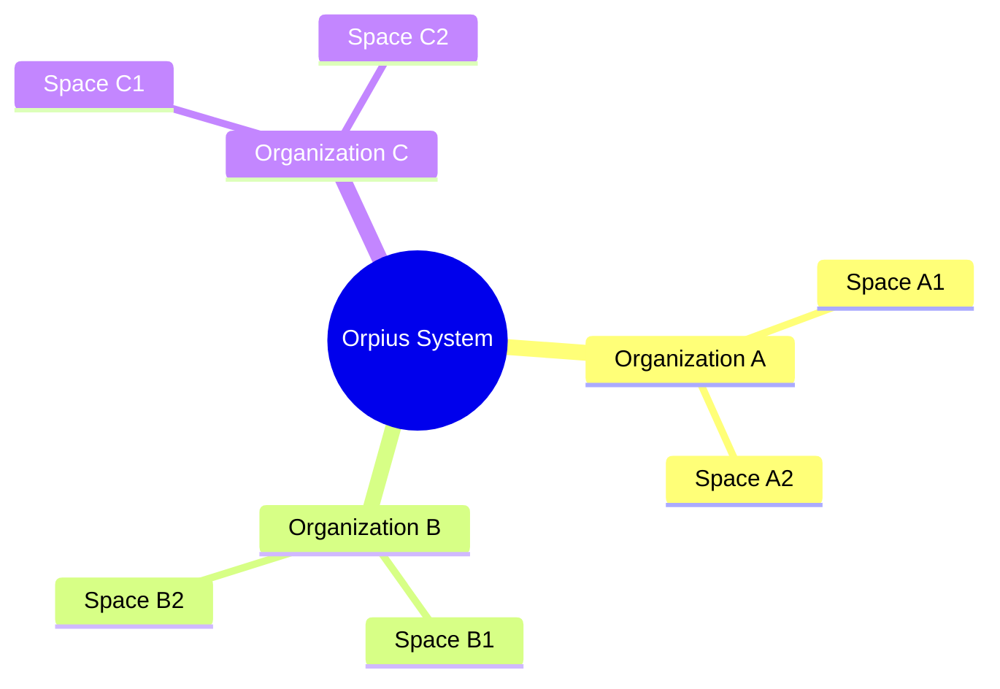
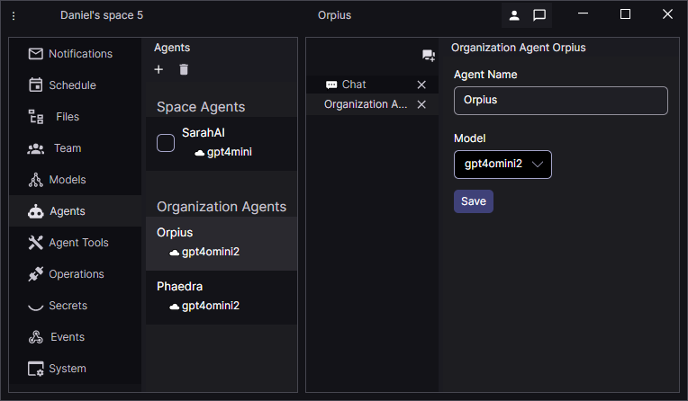
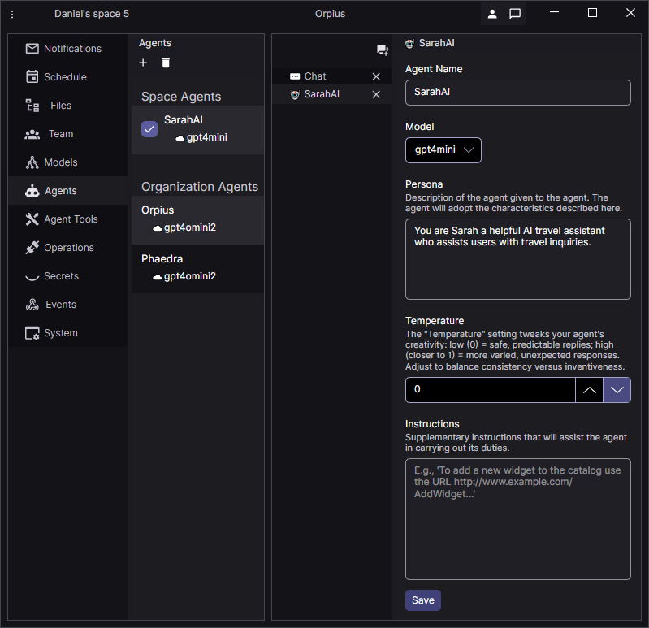

# Orpius User Guide

<!--TOC-->
  - [Introducing Orpius](#introducing-orpius)
    - [For Developers](#for-developers)
    - [For Productivity and Operations Users](#for-productivity-and-operations-users)
  - [What Orpius Provides](#what-orpius-provides)
  - [Built-in Productivity Features](#built-in-productivity-features)
- [Deployment](#deployment)
- [Getting started](#getting-started)
  - [How it works](#how-it-works)
- [Understanding the Orpius System Structure](#understanding-the-orpius-system-structure)
  - [Understanding User Roles](#understanding-user-roles)
    - [Space Roles](#space-roles)
    - [Organization Roles](#organization-roles)
  - [Installing the Client Application](#installing-the-client-application)
  - [Setting up Orpius for the first time](#setting-up-orpius-for-the-first-time)
    - [Setting up email server (System owners only)](#setting-up-email-server-system-owners-only)
    - [Creating a user account](#creating-a-user-account)
    - [Managing System Settings and Limits (System Owners only)](#managing-system-settings-and-limits-system-owners-only)
  - [First Launch](#first-launch)
    - [Understanding Spaces](#understanding-spaces)
      - [Creating a Space](#creating-a-space)
    - [Working with Large Language Models (LLM)](#working-with-large-language-models-llm)
      - [Configuring a New Model](#configuring-a-new-model)
  - [Understanding Agents](#understanding-agents)
  - [Configuring a Custom Agent](#configuring-a-custom-agent)
- [Agent Tools](#agent-tools)
  - [Build-in Tools](#build-in-tools)
- [Custom Tools](#custom-tools)
  - [How it works](#how-it-works)
- [Events](#events)
  - [How it Works](#how-it-works)
  - [Security and Control](#security-and-control)
  - [HTTP Parameters](#http-parameters)
  - [Setting up and event](#setting-up-and-event)
- [Isolated Storage](#isolated-storage)
  - [Uploading files](#uploading-files)
  - [Downloading files](#downloading-files)
  - [Creating files using chat](#creating-files-using-chat)
- [Team Awareness and Management](#team-awareness-and-management)
  - [How it works](#how-it-works)
  - [Adding Members to a Space](#adding-members-to-a-space)
    - [Managing User Limits (System Owners only)](#managing-user-limits-system-owners-only)
<!--/TOC-->

## Introducing Orpius

Welcome to **Orpius** — the secure AI platform that gives you everything 
you need to integrate, build, and use generative AI 
without the complexity of managing the underlying technology.

Security and privacy are built into Orpius from the ground up.
Data is secured both **at rest and in transit**, secrets are managed safely 
through dedicated tools that never expose them to models, and all server 
and internal components follow industry best practices for infrastructure 
and data protection.

### For Developers

Orpius provides a complete, **secure AI infrastructure** for adding 
intelligence to your applications — without building or maintaining it yourself.

Use Orpius as a:

* **Foundation for integrating AI into existing applications**  
  Integrate models, automation, and intelligent processing into your existing systems.
  Orpius manages the infrastructure, data security, and communication pipelines,
  allowing you to focus on application design and functionality.

* **Foundation for developing new AI systems, applications, and tools**  
  Build AI-powered solutions from the ground up in a ready-to-use environment designed for rapid development, flexibility, and robust security.

### For Productivity and Operations Users

Orpius isn't just for developers — it's also a powerful productivity platform.

All configuration and management are handled through the **Orpius Console**,
a desktop client that runs on the same infrastructure as your applications.
The Console provides an interactive, chat-based interface that understands 
the system itself — allowing you to set up and manage AI agents, models,
schedules, events, and even your team without writing code.

## What Orpius Provides

Orpius provides a complete foundation for building AI applications.

It includes:

* **Integration with external systems** via API-driven events or customer-facing AI agents
* **Isolated Code execution environment**  
  Agents can write compilable code and run it in a secure sandboxed environment.
* **Events**  
  Agents are called into action by external systems through registered events.
* **Notifications, messaging, and team awareness**  
  Agents communicate via notifications or email, and are time zone aware;
  enabling team collaboration.
* **Scheduling** for running tasks at defined times or intervals.
* **Memory**  
  Agents manage their own memory, deciding what to keep and when to use it.
* **Video feed image analysis**
* **Web page retrieval**
* **Custom Agent creation**
* **Multi-model support** 
* **Shared team storage**
* **Permissions and Security**
* **Secrets system**
* **Orchestration** 
* **Tools Integration** with Built-in tools that provide core capabilities 
  out of the box and powerful support for custom tooling

## Built-in Productivity Features

The following examples show some of the productivity features available directly 
in the Console. These may give you some sense of what you can achieve 
in your own applications, though with custom tooling you can expand 
the capabilities much further. 

For example, you can use chat in the Console to instruct Orpius to:

* Schedule and carry out tasks
* Read, analyze, and write files
* Apply image analysis to video streams in real time
* Send emails and notifications to members of your team
* Organize meeting that suit everyone's time zone

# Deployment

The Orpius platform is deployed as a single-tenant cloud service. Support for on-premises deployments is planned.

**Note**: A multitenant environment is provided for evaluation and proof-of-concept testing.

# Getting started

Before you can start working with Orpius, you will need:

* **Orpius Client Application (Orpius Console)** – A lightweight desktop client for configuring everything from models to agents and tools.
* **Access to your own LLM provider** – Orpius connects to AI models you choose (hosted on-premises or in the cloud). It currently supports OpenAI and Azure OpenAI, with more providers to follow.
* **Access to an Email server (System owners only)**  
  Because Orpius runs in your own private cloud, email handling is not provided 
  as a shared service. An email server is required during initial setup so new users 
  can verify their email addresses (a sending-only server is sufficient).
  It will also be used to send notifications or messages to team members. 

## How it works

1. **Configure** – Define your Models, Agents, Events, Tools, and Operations 
   in the Orpius Console. (You can think of Operations as the integration mechanism
   that allows your application to communicate with your Orpius AI Agents.)
2. **Integrate with your system** using events or with operations and tooling; using
   the Orpius SDK libraries, allowing you to embed your AI assistant directly 
   into your application.
3. **Execute** – The AI assistant can now call your server-side tools.
   The Orpius Server runs them and manages orchestration, integration, state, storage, and security.

# Understanding the Orpius System Structure

Orpius is organized around organizations and spaces. 

At the top level is the **System**, which represents the Orpius installation itself.
Within the system, there are multiple organizations.

The **Organization** represents your company or organization.
Each organization has its own storage allocation, and set of members.

Each Organization contains one or more **Spaces**.
A Space is a dedicated workspace for a specific project or team.
Each Space contains all the resources for that project, 
such as agents, tools, models, operations, and events,
and has its own isolated storage area.



*The Orpius system contains organizations, which contain spaces*

> **NOTE:** When a user registers with Orpius, a default organization 
and space are created automatically for that user. 
You may invite other users to join your organization and collaborate in the same space.

## Understanding User Roles

A user may have different roles across different organizations and spaces.

### Space Roles
* **Participant** - Can receive notifications and perform tasks.
* **Editor** – Able to create and modify content and manage schedules and events in the space. 
* **Administrator** – Able to add new members and manage space settings.
* **Owner** – Able to delete the space or assign administrator privileges.

### Organization Roles
* **Participant** - A member of a space within the organization.
* **Administrator** – Able to add or remove members and manage organization settings.
* **Owner** – Able to delete the organization or assign administrator privileges.
  Able to manage language models.

## Installing the Client Application

The Orpius Console is a lightweight desktop application 
that connects directly to the Orpius infrastructure.

To get started, you'll receive a message from us containing:

1. A link to download the **Orpius Console**.
2. The Orpius Server URL.
3. Your Access Key (System owners only).

Follow these steps:

1. Open the download link and click **Download Orpius Console**.
2. Run the installer after the file finishes downloading.
3. Once installation is complete, launch the Orpius Console.
4. Enter the **Server URL** into the field provided.
5. Enter the **Access Key** (System owners only).

## Setting up Orpius for the first time

If you are the system owner of an Orpius installation,
you will be prompted to set up the system the first time you launch the Orpius Console.

### Setting up an email server (System owners only)

During the first-time setup of the Orpius server, you'll be prompted 
to enter your email server details.
The email server is used by Orpius to handle email requests 
such as sending messages to team members. 
Setting up the email server is required because it allows 
new users to verify an email address. 

Enter your email server details. 
You can update this information later in **System Settings** within the application.

### Creating a user account

Every Orpius user creates and signs into a user account.

During the first time setup, you'll be prompted to create your account.

* Enter your account **Username**, **Email**, **Given Name**, **Surname** and **Password** into the fields provided.

> **Note:** At present, account information can't be changed after your account is created. 
  Options to update these details will be available in an upcoming version.

You'll receive a confirmation email from the system address you configured 
during email server setup (e.g. noreply@yourdomain.com) containing a code.

If you see an error message, click **Previous** and check that your email address 
and email server information are correct.

## First Launch

After completing the initial setup, Orpius opens in the Organisation view, 
where you can see a list of the Spaces you belong to. 
Each user begins with a default Space that is created automatically. 
For more details on creating and managing Spaces, see [`Spaces`](#spaces).

### Understanding Spaces

A space is your working area inside the Orpius Console. 
Each space keeps everything related to a project or team in one place. 
You can also invite members (inside or outside your organization) to collaborate 
in a space. Members can be invited into a space and granted access through roles.

Your Spaces are listed on the Organization View page, where you can:

* **Open** an existing space
* **Create** a new space
* **Delete** a space

Within a Space, you can:

* View **notifications**
* View and manage **scheduled tasks**
* Upload and download **files** to and from your isolated storage
* Invite and manage **members** for collaboration
* Configure your models, agents, tools, operations, secrets, and events
* Interact with AI agents via chat 

#### Creating a Space

To create a new Space:
1.	From the **Organization View** page, select **Create a Space**.
2.	Enter a name for the Space. 
3.	Confirm to create.

### Working with Large Language Models (LLM)

The system is designed to work with any LLM, whether hosted **on-premises** or in the **cloud**.
Currently, OpenAI and Azure OpenAI are supported, with more providers to follow.

You can configure as many models as you need, from different providers. 
For example, some agents might use GPT-4o for complex tasks, while others can run on a lower-cost model such as OpenAI gpt-4o-mini. 

#### Configuring a New Model

1. Open the **Models** view from the sidebar 
2. Select **'+'** button in the toolbar of the **Models** view
3. Enter the required information
4. Save

## Understanding Agents

In Orpius, agents are consider users, just like humans. 
Orpius includes two built-in agents: **Orpius** and **Phaedra**.
* **Orpius** is the agent you interact with directly through chat, and who orchestrates non-interactive activites.
* **Phaedra** carries out non-interactive activities, such as scheduled tasks and event execution.

Both Orpius and Phaedra are **organization-wide** agents available in every space.
In addition, you can create **custom agents** dedicated to specific operations within a space,
allowing you to provide a custom persona and instructions to your agent.

By default, Orpius and Phaedra use the first LLM you define, 
but you can assign them to any of your available LLMs.



Agents in Orpius do not have fixed tools or workflows of their own.
Instead, they draw from a shared pool of tools.

When integrating your application with Orpius, 
you configure a **Custom Agent**. This agent will handle all incoming requests 
from your application.

## Configuring a Custom Agent

To create a custom agent, perform the following steps:

1. Open the **Agents** view from the sidebar 
2. Select **'+'** button in the toolbar of the **Agents** view
3. Give the Agent a **Name**
4. Select a suitable **Model** for your Agent
5. Define the Agent's **Persona**
6. Set the Agent's **Temperature**
7. Provide further **Instructions** that will assist the agent in carrying out its duties.
8. Save.



**Configuring a custom agent**

## Agent Tools

Tools are functions that your agent can call to perform specific tasks.
Tools in Orpius are not tied to a single agent.
They live in a shared pool that any agent can access if it has permission.
Tools can be combined, triggered by events, and reused across different agents.
Agents can autonomously select and combine the tools they need to complete a task.

Tools can be either built-in or custom.

### Reviewing the Built-in Tools

Orpius includes the following set of built-in tools:

* **Scheduler** – Allows an AI agent to add work items to be done at a future time. 
  Schedules can be of the type:
  * **Daily** - to run at a specified time
  * **Weekly** - to run on a specified day of the week and specified time
  * **Monthly** – to run on a specified day of the month and time
  * **Yearly** - to run on a specified day of the month and time
  * **Interval** - to run after a specified period and may be set to repeat forever 
    or loop for a specified number of times.
* **WebPageRetriever** – Retrieve the HTTP response for a specified URL. 
  Allows for the use of web APIs.
* **WebSearch** – Allows an AI agent to search in internet using Bing. An API key is required.
  Note that Bing Search APIs retired on August 11, 2025.
* **Notifier** – send notifications to a user. A notification may also be sent by email to the user. 
  The user's email is never provided to an agent.
* **CodeExecution** – Compiles and runs managed code and passes the results back to the agent.
  This allows the assistant to complete tasks that require calculations, 
  storing and retrieving data from files, or calling third-party APIs.
  The execution environment is sandboxed and hosted within WebAssembly (Wasm), 
  isolating it from other processes or code execution.
* **ImageAnalysis** – Allows an agent to analyze an image, 
  either from a specified image URL or by snapping a frame from a real-time video stream. 
* **VideoFeedMonitor** – Real Time Streaming Protocol (RTSP). 
  Downloads a still image from a video feed which can be used for image analysis.
* **EventRegistry** – Registers an event name that can be used by a remote API to trigger a task. The identifier can then be used with a web hook in the system.
* **Memory** – Allows an agent to add a record of an event or experience to the agents memory store, enabling it to track changes across multiple tasks.
* **EventTrigger** - Triggers an event that was previously registered.

The following **example** shows how a simple instruction can lead 
the agent to **autonomously** combine **multiple tools** to complete the task.

**Prompt:**

>*Add a scheduled item for every 5 minutes to analyze rtsp://orpius:<%=Key:WebCam%>@CAMERA_IP:554/cam/realmonitor?channel=1&subtype=0. Please record the car colors and their position in the bays to a csv file named 'parking.csv' by appending to the file. If it doesn't exist, create it with the column headers. If it already exists then append the data to the file without the headers.
Include a row for each car you see. Notify John if cars are parked in the restricted space.*

**What the agent does:**
1. Attends to the task every five minutes **(Scheduler)**
2. Retrieves the video stream URL **(Secrets)**
3. Connects to the video stream **(VideoFeedMonitor)**
4. Analyses the image to detect parked cars **(ImageAnalysis)**
5. Writes the findings to a file **(CodeExecution)**
6. Notifies the user if an issue is detected **(Notifier)**

### Custom Tools

In addition to the built-in tools, you can register your own custom tools located on your organization's network.
These extend the system with domain-specific capabilities that your agents can use during inferencing.

**Custom tools** can expose almost any functionality available within your environment. 

For example, you can create tools that:

* **Connect to your organisation's database** 

* **Access internal APIs** 

* Perform domain-specific calculations or lookups, such as pricing estimates, scheduling logic, or engineering models.

* **Interface with third-party systems** (e.g., ERP, CRM, or ticketing platforms) through secure API calls.

* Trigger automation tasks such as sending notifications, generating reports, or updating shared files.

Each custom tool is registered in the system with a unique name and made available to AI Agents under your control. This allows agents to call your organisation’s existing code, libraries, or services securely—without exposing them externally.

## How it works

1. **Register a custom tool** – Open the **Agent Tools** view from the sidebar and select **Custom Tools** .
2. **Integrate with your application** – Copy the **External ID** and **Access Key**, then paste them into **your application**.
3. **Expose functionality to Orpius** – Decorate your code with the [Tool] and [ToolMethod] attributes.
4. **Execute** – The Orpius SDK automatically receives and dispatches tool requests at runtime.

See the **SDK documentation** for more details on custom tools. Example implementations are included in the downloadable SDK.

# Events

Events provide a secure way to connect your systems with Orpius and perform activities in response to external triggers.

## How it Works

* In the Console, you register events that external systems can call through a remote API to trigger tasks. Each event has a unique identifier that can be used in a webhook or integrated system. 
* After registering an event, you add the activities or follow-up events that should run when it is triggered. 
* Orpius then orchestrates the response in real time.

**Example of how events may flow in a Surveillance Application**
* A camera sends a motion detected event. 
* You configure this event to trigger a notification activity and an analysis activity.
* Orpius then orchestrates the response: it notifies the right user, launches the analysis, and, depending on the outcome, can automatically trigger follow-up actions such as raising an alert, starting a recording, or handing off to another tool.

(Note: In the current release, events are handled by the in-built Orpius agents.)

## Security and Control

Orpius is designed to be adaptive rather than follow rigid workflows. To keep this behaviour reliable, you can set **guardrails** by defining which **tools** and **constraints** an agent is allowed to use.

The event system can also provide a built-in **security layer** based on the principle of Segregation of Duties (SoD). Customer-facing agents can trigger events to request actions from more privileged agents, without having direct access to sensitive capabilities such as scheduling, storage, or team information.

## HTTP Parameters

**GET**
* Parameters starting with an underscore ( _ ) are passed to your tool only.
* Parameters without an underscore are passed to your tool and the AI Agent.

**POST**
* Everything that comes in apart from the access key is sent in the context to your tool. To see more information on the context property see *[Including Call Specific Information in a Chat](../DevelopmentGuides/DotNet/index.md#Including Call Specific Information in a Chat)* in the Developer Guide.

## Setting up and event

There are two ways to define an event in Orpius: manually or through chat.

**Tip**: When defining activities that are triggered by an event, avoid using words such as schedule or references to the event itself in the task instruction. This can confuse the agent, leading it to interpret the instruction as a command to schedule itself or create a new event. Instead, phrase the instruction as an immediate action.


**Manual setup**
1. **Register the Event**
    * Open the **Events** view from the sidebar.
    * Select the **'+'** button in the toolbar of the **Events** view
    * In the **Event Configuration** view, enter the event name (for example, *NewOrderReceived*).
2. **Define the Triggered Work (Activity)**
    * In the **Event Triggered Work** view, select the **'+'** button in the toolbar of the **Event Triggered Work** view.
    * Provide a **Title** and clear **Instructions** for the agent (for example, *"send a notification to the user"*).
    * You can define multiple activities for the same event.
    * *(Upcoming feature)* Supply Custom Tools that the agent can use when executing the task.
3. **Trigger and Execute**
    * When an external system fires the *NewOrderReceived* event, Orpius automatically executes the defined activity.


**Setup via Chat**

Orpius understands events and can be instructed through chat to create new ones with specific actions.

* Start a new **Chat** 
* For example, you could say: *"Create an event named 'NewOrderReceived' that sends me a notification with the order details when triggered."*
* Orpius will then register the event and set up the instructions accordingly, including your user ID for proper execution.
* Open the **Events** view to review or modify the newly created event.


# Isolated Storage

Each organisation has an allocated shared storage area that can be used across its spaces.

Files uploaded here can be accessed directly by agents within the same space. This allows you to provide data, documents, or other resources for your agents to use while keeping everything securely contained.

Agents can read, write, and modify files within this storage.

For example, you could upload a sales report and ask Orpius:

*"Summarise the key trends from last quarter's sales and write the summary to a file called SalesSummary.txt. If the file already exists, append to it."*

Access to files within a space is controlled by permission levels. Members with roles above Participant have access to files in that space.

## Uploading files

* Open the **Files** view from the sidebar
* Click the **Upload** button in the toolbar of the **Files** view and select the files you want to upload
* Click **Open**


## Downloading files

* Open the **Files** view from the sidebar
* Select the file(s) you wish to download and click the **Download** butoon in the toolbar of the **Files** view
* Choose the folder where you want the files saved

**Please note**: in the pre-release version, files downloaded locally are not being managed. This means they may overwrite an existing file in the chosen folder without warning.

## Creating files using chat

Orpius can create a wide variety of file types depending on your needs. Common examples include text files (e.g. .txt, .csv), code files (e.g. .cs, .py, .js), document files (e.g. .md, .html), and data files (e.g. .json, .xml).
* Start a new **Chat**
* For example, you could say: *"Create a file called test.txt and insert 10 city names."*
* Orpius will create a new file named test.txt containing the 10 city names and save it in your isolated storage directory.

# Team Awareness and Management

Each organization can contain multiple spaces, and each space can have as many members as needed. 

Orpius has built-in team awareness across time zones and can plan or take actions based on that.

## How it works

* For example, you can use the chat and ask *"Who is on my team?"*
* Orpius will respond with a list of team members. 
* Or you might ask *"Please thank John for the lovely flowers"*
* Orpius will send John both an email and a notification on your behalf.


## Adding Members to a Space

Users with the **Administrator** or **Owner** permission level can invite members to a space, either from within or outside the organisation.

Each member is assigned a **role** that determines their permissions:

* **Participant** – minimal access. Can receive notifications (email) and perform tasks.
* **Editor** – includes all Participant privileges, plus the ability to modify content and manage tasks in the space.
* **Administrator** – can manage members, configure settings, and oversee activity.
* **Owner** – full control over the space, including deleting it or transferring ownership.

**Adding a member to a space:**
* Open the **Team** view from the sidebar
* Select the **'+ Add New Team Member'** button in the toolbar of the **Team** view
* Search for the team memebr you wish to add
* Select the desired permission, optionally enter a message for the team memeber
* Send Invitation

**Accepting invitation:**
* Sign in to the Orpius Console and select any Space (invitations are visible in all your spaces).
* Open the **Notification** View - You'll see an invitation notification to a Space you've been invited to join.
* Accept the invitation
* Sign in again to access the Organization View, where you can see your new Space.

### Managing User Limits (System Owners only)

System owners can configure limits that control user access across the organisation:
* **Set the maximum number of users** in an organisation.
* **Set the maximum number of administrators** in an organisation.
* **Restrict new users** to having an email address within the organisation by configuring a regular expression. For example: ```^[A-Za-z0-9._%+-]+@yourcompany\.(com|org|net)$```

### Managing System Settings and Limits (System Owners only)

System Owners can manage key configuration options and restrictions in the **System Settings**.

Key areas include:

* **Email Server** - Change the settings you configured when first setting up the system.

* **SMTP Event Server Port** – Specify the port used by the Orpius SMTP server for incoming email notification.

* **Organisation** – Set the maximum number of users and administrator users allowed in an organisation.

* **Application** - Restrict new users to those from within your organisation. Set limits for cache item lifespan, refresh token lifespan, and timeouts.

* **Inferencing** – Manage limits on inferencing operations.

* **Workflow** – Control limits related to workflow execution and activity processing.